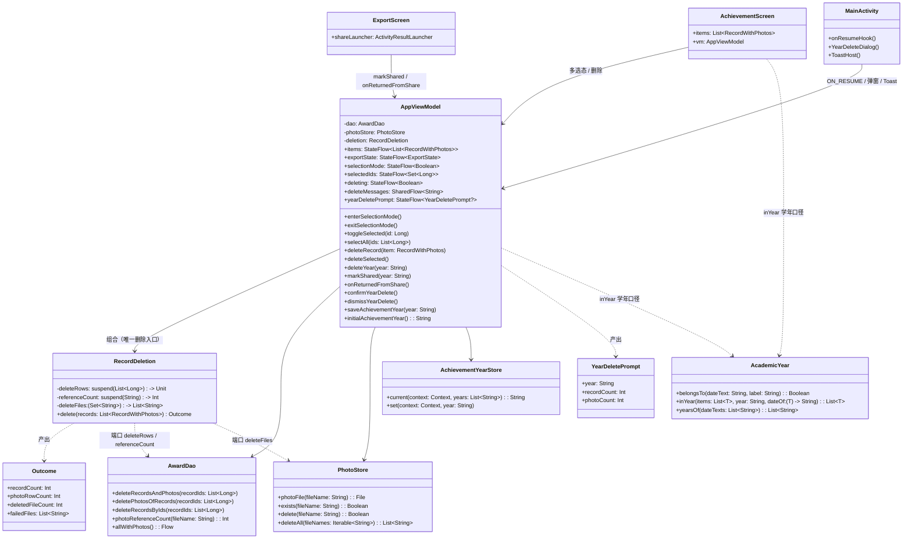
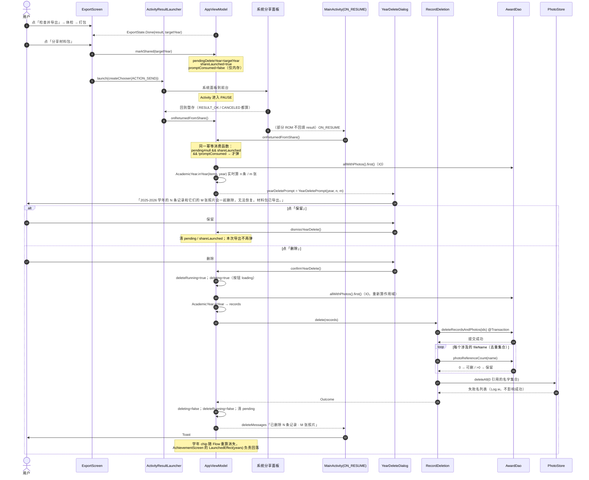
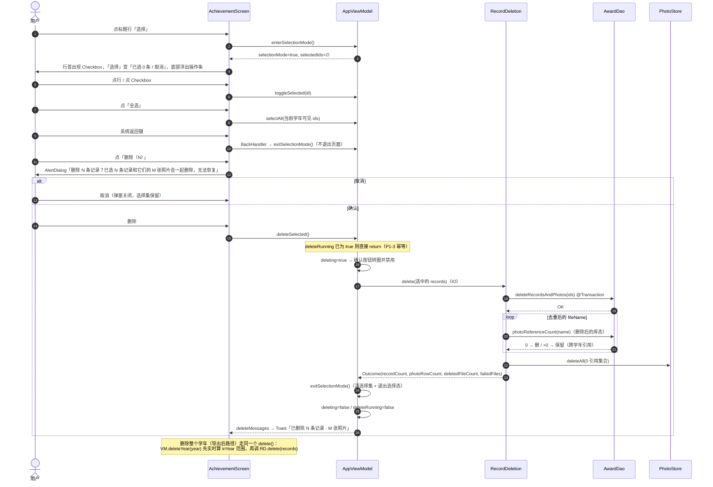
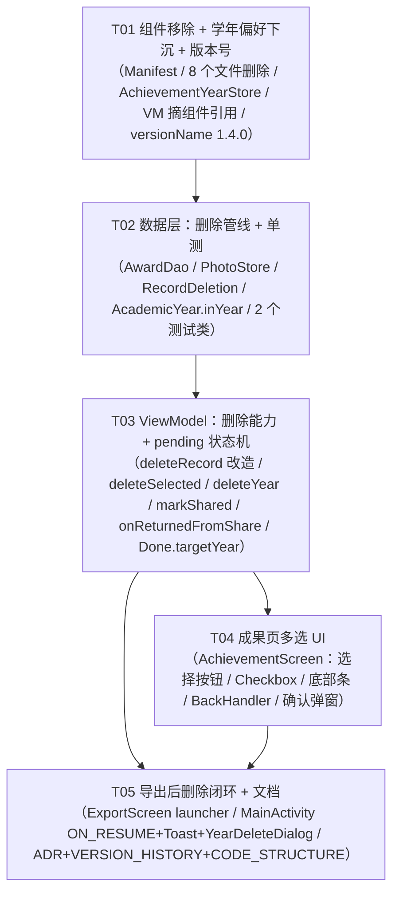

# 系统设计：删除能力（多选 + 导出后清学年）与「成果概览」组件精简

| 项 | 内容 |
| --- | --- |
| 文档版本 | v1.0（架构评审稿） |
| 日期 | 2026-09-23 |
| 作者 | Bob（架构师） |
| 对应 PRD | `docs/prd/prd-删除与组件精简-v1.4.0-2026-09-23.md` |
| 目标版本 | **v1.4.0**（versionCode 由 CI 注入 `1000000+run_number`，本地只改 `versionName` 默认值） |
| 技术栈 | Kotlin · Jetpack Compose · Material 3 · Room 2.6.1 · Navigation Compose · Glance（仅保留快速录入组件） |

> 本文只做设计与任务分解，**不改任何业务代码**。所有行号以 2026-09-23 的 `main`（`8c2af10`）为准。

---

## Part A：系统设计

### 1. 实现方案与选型

#### 1.1 三件难事与对应的技术选择

| # | 难点 | 方案 | 为什么不走别的路 |
| --- | --- | --- | --- |
| **D1** | **删除不可逆，且要连带删磁盘文件，但不能误删仍被引用的照片**（PRD §5.2 的引用计数陷阱） | 抽出**纯 Kotlin 删除编排器** `data/RecordDeletion.kt`：注入三个端口（删 DB 行 / 查引用计数 / 删文件），内部强制「**先 DB 事务 → 再按删除后的库态重查计数 → 只删 0 引用文件**」 | 现有 `AppViewModel.deleteRecord()` 把顺序写死在协程里，无法被 JVM 单测覆盖（本项目 `app/src/test` 是**纯 JUnit4，无 Robolectric、无 androidx.test**，`AndroidViewModel`/Room 在 JVM 上跑不起来）。抽成纯类 + 端口后，PRD 要求的「跨学年引用同一张照片时文件不能被删」可以用假实现直接断言，零 Android 依赖。这是本次**唯一能落地的单测路径** |
| **D2** | **「用户从分享面板回到 App」这件事没有可靠回调**（部分 ROM 的 chooser 不回填 ActivityResult） | `ActivityResultLauncher`（主路径）+ `Lifecycle ON_RESUME` 观察（兜底），**两条路径共用同一个幂等消费函数** `consumePendingDeletePrompt()`，VM 内 `promptConsumed` 保证一次导出生命周期只弹一次 | 只用 launcher：ROM 上不回填就永远不弹；只用生命周期：无法区分「分享前的一次普通 resume」→ 必须再加 `shareLaunched` 标志位。二者都要，且必须幂等 |
| **D3** | **成果页没有自己的 topBar / bottomBar**（`MainActivity` 的 `Scaffold` + `NavHost` 承载），「选择」按钮和底部操作条无处安放 | ①「选择」放进 `LazyColumn` 的标题 item（与副标题同一 `Row`）；②底部操作条用 `Box` 包裹 `LazyColumn` + `Alignment.BottomCenter` 的 `Surface`，**不动 `Scaffold`**；③返回键用 `BackHandler`（`activity-compose` 1.9.2 已带） | 给 `AchievementScreen` 加 `Scaffold.topBar` 会与 `MainActivity` 的 `NavHost` padding 打架（双份 contentPadding）；改 `MainActivity` 给单页加 topBar 会让其它四个页面一起变 |

#### 1.2 关于「有没有更简单的路」的取舍记录

- **删除顺序（P1-2）能不能不改？** 不能。现顺序「先删文件 → 后删 DB」在 DB 失败时会造成**永久缺图且不可逆**；反转后最坏结果是「残留孤儿文件」（无害、可容忍）。本期顺带把**单条删除**也走同一条管线，不让旧的错误顺序留存两份。
- **学年删除能不能直接复用 `ExportCheck.targetItems`？** 不。主理人已拍板用严格 `AcademicYear.belongsTo`。为避免「同一个谓词两处实现」，本次在 `AcademicYear` 里新增**唯一的严格过滤函数** `inYear()`，成果页展示、多选删除范围、学年删除范围三处共用。
- **多选态能不能留在 Composable `rememberSaveable`？** 主理人已定 ViewModel。理由补记：`RecordWithPhotos` 不可序列化，进 `SavedStateHandle` 要额外转换；而删除进行中需要「禁用 + loading」，这个状态本来就得跨重组存活，放 VM 更省事。
- **`WidgetYearStore` 能不能直接删掉？** 不能。它是成果页「记住上次选的学年」的唯一持久化点。**下沉改名**为 `data/AchievementYearStore.kt`，`SharedPreferences` 名 `jicun_achievement_widget`、键 `selected_year` **一字不改**，老用户升级不丢学年。
- **把 `AchievementListWidget` 的 RemoteViews 代码留着但注销 receiver？** 不。PRD P0-6 要求 100% 移除，且留着会持续产生「死代码 + 资源引用」噪音。

#### 1.3 架构分层（未引入新框架，全部复用既有）

```
ui/  AchievementScreen ──┐
     ExportScreen ────────┤
     MainActivity ────────┼── AppViewModel ── RecordDeletion ─┬─ AwardDao(Room @Transaction)
                          │        │                          └─ PhotoStore(filesDir/photos)
                          │        └── AchievementYearStore(SharedPreferences)
                          └── YearDeleteDialog / Toast
```

- **MVVM + 单向数据流**（沿用现有 `StateFlow` + `viewModelScope` 风格，无 MVI 框架、无额外依赖）。
- **删除执行器下沉到 `data/`**：它是「业务规则」不是「UI 编排」，且必须能被 JVM 单测直接实例化。
- **不新增任何第三方依赖**（`BackHandler` / `rememberLauncherForActivityResult` / `Checkbox` / `LocalLifecycleOwner` 全在现有依赖里）。

---

### 2. 文件清单

#### 2.1 新增（5 个）

| 相对路径 | 这个文件要干什么 |
| --- | --- |
| `app/src/main/java/com/zongce/app/data/RecordDeletion.kt` | **删除编排器（纯 Kotlin，零 Android 依赖）**。注入 `deleteRows` / `referenceCount` / `deleteFiles` 三个端口，强制「先 DB 事务 → 再重查计数 → 只删 0 引用文件」；返回 `Outcome(记录数, 随记录删掉的照片行数, 实际删掉的文件数, 删除失败的文件名)`。类注释必须写清顺序铁律的由来 |
| `app/src/main/java/com/zongce/app/data/AchievementYearStore.kt` | 成果页学年偏好（由 `widget/WidgetYearStore.kt` 下沉）。`current(context, years)` / `set(context, year)` 两个方法；`PREFS="jicun_achievement_widget"`、`KEY="selected_year"` **保持原值**；`commit()` 同步落盘沿用；**删除** `shift()`（组件箭头专用，随组件一起废） |
| `app/src/main/java/com/zongce/app/ui/YearDeleteDialog.kt` | 导出后「删除这一学年？」确认弹窗，与 `UpdateDialog.kt` 同级、同样在 `MainActivity.App()` 里渲染（保证回 App 后落在任何 tab 都能看到）。确认按钮在 `deleting==true` 时显示 `CircularProgressIndicator` 并禁用（PRD P1-3，按钮内 loading，不做全屏进度条） |
| `app/src/test/java/com/zongce/app/data/RecordDeletionTest.kt` | **本期必测**：跨学年引用 → 文件不删；DB 失败 → 文件不动；0 引用 → 删；文件删失败 → 整体仍成功只记 `failed`；同名去重只查一次 |
| `app/src/test/java/com/zongce/app/core/AcademicYearYearScopeTest.kt` | 严格学年口径 `AcademicYear.inYear()` 的用例（学年显式钉死为 `"2025-2026"`，不许用当前日期） |

#### 2.2 修改（11 个）

| 相对路径 | 要干什么 |
| --- | --- |
| `app/src/main/java/com/zongce/app/data/AwardDao.kt` | 新增 `@Transaction suspend fun deleteRecordsAndPhotos(recordIds)` + `deletePhotosOfRecords(ids)` + `deleteRecordsByIds(ids)`。事务内**先删 photos 后删 records**（外键 `ON DELETE CASCADE` + 默认 `ABORT`，反序会撞外键约束）。`recordIds.chunked(500)` 规避 SQLite 999 参数上限 |
| `app/src/main/java/com/zongce/app/data/PhotoStore.kt` | `delete(fileName)` **返回值改为 `Boolean`**（= `File.delete()` 结果）；新增 `deleteAll(fileNames: Iterable<String>): List<String>`（内部 `distinct()` + 逐个删 + 收集失败名 + `Log.w`）；类注释补一句「删除只在 0 引用时由 `RecordDeletion` 调用」 |
| `app/src/main/java/com/zongce/app/core/AcademicYear.kt` | 新增**唯一的严格学年过滤**：`fun <T> inYear(items: List<T>, year: String, dateOf: (T) -> String): List<T>`。给成果页展示、多选范围、学年删除三处共用。`ExportCheck.targetItems` 仍是**导出口径**的唯一实现，两者不合并 |
| `app/src/main/java/com/zongce/app/ui/AppViewModel.kt` | 见 §3.1：① 删 widget import / `refreshWidget()` / `syncWidgetYear()` / `widgetYearRequests` 队列里对组件的推送（**队列本身保留**，只去掉 push）；② `initialWidgetYear()` → `initialAchievementYear()`；③ `deleteRecord()` 改走 `RecordDeletion`；④ 新增多选态 + `deleting` + 删除结果消息流；⑤ 新增导出后删除的 pending 状态机；⑥ `ExportState.Done` 加 `targetYear` |
| `app/src/main/java/com/zongce/app/ui/AchievementScreen.kt` | ① chip `onClick` 改调 `vm.saveAchievementYear(year)`；② `LaunchedEffect(Unit)` 改调 `vm.initialAchievementYear()`；③ `ofYear` 改用 `AcademicYear.inYear()`；④ 标题行右侧加「选择 / 取消」`TextButton`；⑤ 选择模式下 `RecordRow` 左侧 `Checkbox`、隐藏 `ChevronRight`；⑥ `Box` 包 `LazyColumn` + 底部操作条（全选 / 删除 N）；⑦ `BackHandler` 优先退出选择态；⑧ 多选删除确认 `AlertDialog` |
| `app/src/main/java/com/zongce/app/ui/ExportScreen.kt` | 「分享材料包」改走 `rememberLauncherForActivityResult(StartActivityForResult())`：构造 chooser Intent → `vm.markShared(targetYear)` → `launcher.launch(intent)`；回调里 `vm.onReturnedFromShare()`。`targetYear` 从 `ExportState.Done.targetYear` 取（不再依赖 UI 局部 `var`，避免 `LaunchedEffect(availableYears)` 回落把它改掉） |
| `app/src/main/java/com/zongce/app/MainActivity.kt` | ① `DisposableEffect` 挂 `ON_RESUME` → `vm.onReturnedFromShare()`（兜底路径）；② `LaunchedEffect(Unit)` 收集 `vm.deleteMessages` → `Toast`；③ 渲染 `YearDeleteDialog`（与 `UpdateDialog` 并列） |
| `app/src/main/AndroidManifest.xml` | 删除第 51–67 行「成果概览」`<receiver>` 及其 6 行注释块（保留快速录入 receiver 与 FileProvider） |
| `app/build.gradle.kts` | 第 18 行 `versionName` 兜底 `orElse("1.3.6")` → `orElse("1.4.0")`；`versionCode` **不动**（CI 注入） |
| `app/src/main/res/values/strings.xml` | 删除 `achievement_widget_label`、`achievement_widget_description` 两条 |
| `docs/adr/0002-widget-reads-summary.md` | 正文顶部加 `## Status: Deprecated (2026-09-23)` 说明 + 指向本 PRD 与本设计文档；**不删历史正文** |
| `VERSION_HISTORY.md` / `CODE_STRUCTURE.md` | v1.4.0 记录卡；`CODE_STRUCTURE.md` 补 `RecordDeletion` / `AchievementYearStore` 条目、`AppViewModel` 职责里删掉「推送成果组件」一句 |

> `app/src/test/java/com/zongce/app/core/AcademicYearTest.kt` 也可直接追加，不另起文件；两者二选一，**不要重复**。

#### 2.3 删除（9 项）

| 类型 | 相对路径 | 判定依据（本次复核结论） |
| --- | --- | --- |
| Kotlin | `app/src/main/java/com/zongce/app/widget/AchievementListWidget.kt` | 组件主体，211 行 |
| Kotlin | `app/src/main/java/com/zongce/app/widget/WidgetYearStore.kt` | 已由 `data/AchievementYearStore.kt` 承接（`shift()` 随组件废弃） |
| Manifest | `app/src/main/AndroidManifest.xml` 第 51–67 行 | `.widget.AchievementListWidget` 的 `<receiver>` + 其上 6 行注释 + `intent-filter` + `meta-data` |
| XML | `app/src/main/res/xml/jicun_achievement_widget_info.xml` | 组件登记信息 |
| Layout | `app/src/main/res/layout/widget_achievement_list.xml` | 组件 RemoteViews 布局 |
| Layout | `app/src/main/res/layout/widget_preview_achievement.xml` | 组件选择器预览布局 |
| Drawable | `app/src/main/res/drawable/widget_achievement_bg.xml` | 全仓 grep：仅 `widget_achievement_list.xml` 引用 |
| Drawable | `app/src/main/res/drawable-nodpi/widget_preview_achievement_img.png` | 全仓 grep：仅 `jicun_achievement_widget_info.xml` 的 `previewImage` 引用 |
| String | `res/values/strings.xml` 的 `achievement_widget_label`、`achievement_widget_description` | 仅 Manifest / 组件 info xml 引用 |

#### 2.4 明确保留（共用资源判定口径 —— 本次已 grep 复核，PRD §8-Q5 的答案）

| 对象 | 结论 | 依据 |
| --- | --- | --- |
| `drawable-xxhdpi/widget_logo.png` | **保留** | 三处引用：`widget_preview_entry.xml:26`（快速录入预览）、`JicunWidget.kt:71`（Glance 组件运行时）、以及将删的 `widget_preview_achievement.xml:30`。**删除后前两处仍在** |
| `drawable/widget_preview_bg.xml` | **保留** | `widget_preview_entry.xml:11` 引用（快速录入预览） |
| `drawable/widget_preview_tile_container.xml` / `widget_preview_tile_primary.xml` | **保留** | 仅 `widget_preview_entry.xml:50/74` 引用，属快速录入 |
| `res/layout/widget_preview_entry.xml`、`res/xml/jicun_widget_info.xml`、`drawable/ic_widget_camera.xml`、`ic_widget_gallery.xml`、`widget/JicunWidget.kt`、`widget/JicunWidgetReceiver.kt` | **保留** | 快速录入组件全套 |
| `WidgetActions.kt`（含 `OPEN_ACHIEVEMENT`） | **保留** | PRD §7.3 明确要求；`MainActivity` 的 action 路由仍在。**但 `OPEN_ACHIEVEMENT` 在组件移除后已无发送方**，成为死分支 —— 不删（改它要动 `isWidgetAction` 协议），在 `CODE_STRUCTURE.md` 里记一句 |
| `tmp/gen_widget_previews.py` | **保留，但需 grep 复核** | 它同时生成两个预览位图；删完成果预览后脚本里对应的 achievement 分支应一并清掉（否则下次跑会指向已删资源）。执行时先 `grep -n achievement tmp/gen_widget_previews.py` |
| `cacheDir/exports/*.zip` | **永不删** | PRD §5.4 铁律；`ZipExporter` 在下次导出时清 `outDir` 是既有行为，保持不变 |

---

### 3. 数据结构与接口

#### 3.1 类图



#### 3.2 关键签名（`AppViewModel` 新增 / 变更部分）

```kotlin
// ---------- 多选态（成果页，P0-1）----------
private val _selectionMode = MutableStateFlow(false)
val selectionMode: StateFlow<Boolean> = _selectionMode.asStateFlow()

private val _selectedIds = MutableStateFlow<Set<Long>>(emptySet())
val selectedIds: StateFlow<Set<Long>> = _selectedIds.asStateFlow()

/** 进入多选模式（标题行「选择」）。进入即清空上一轮选择集。 */
fun enterSelectionMode()

/** 退出多选模式（标题行「取消」/ 返回键 / 删除成功后）。 */
fun exitSelectionMode()

fun toggleSelected(id: Long)

/** 全选：scope = 当前学年可见列表，由 UI 传入，VM 不猜范围。 */
fun selectAll(ids: List<Long>)

/** 删除执行中：确认按钮 loading + 禁用。 */
val deleting: StateFlow<Boolean>

/** 删除结果提示（Toast 文案，best-effort，UI 不在前台就丢）。 */
val deleteMessages: SharedFlow<String>   // MutableSharedFlow(extraBufferCapacity = 1, replay = 0)

// ---------- 删除执行 ----------
/** 单条（列表页现有入口）。改为走 RecordDeletion，顺序与批量一致。 */
fun deleteRecord(item: RecordWithPhotos)

/** 批量（成果页多选）。幂等：执行中再触发直接 return。 */
fun deleteSelected()

/** 删除整个学年（导出后确认）。作用域重新按 belongsTo 实时计算，不用导出快照。 */
fun deleteYear(year: String)

// ---------- 导出后删除的 pending 状态机（P0-4 / P0-5）----------
data class YearDeletePrompt(val year: String, val recordCount: Int, val photoCount: Int)

val yearDeletePrompt: StateFlow<YearDeletePrompt?>

/** 点「分享材料包」时调用：只记内存，不持久化。 */
fun markShared(year: String)

/** launcher 回调 与 ON_RESUME 兜底 共用；幂等，一次导出生命周期只弹一次。 */
fun onReturnedFromShare()

fun confirmYearDelete()
fun dismissYearDelete()

// ---------- 学年偏好（P1-4）----------
/** 原名 syncWidgetYear：仍走单消费者 Channel 串行写盘，只是不再推送组件。 */
fun saveAchievementYear(year: String)

/** 原名 initialWidgetYear：查库算 years 后读偏好回落。 */
suspend fun initialAchievementYear(): String

// ---------- 导出状态 ----------
data class Done(val result: ExportResult, val targetYear: String): ExportState()
```

**pending 状态机的内部字段（全部 `@Volatile` 私有，主线程读写）**：

```kotlin
private var pendingDeleteYear: String? = null  // 只存内存
private var shareLaunched = false              // 是否已经发起过分享（挡住"分享前的普通 resume"）
private var promptConsumed = false             // 本次导出生命期内是否已弹过
private var deleteRunning = false              // P1-3 幂等标志位
```

`consumePendingDeletePrompt()` 伪码：

```
if (pendingDeleteYear == null) return
if (!shareLaunched) return
if (promptConsumed) return
if (deleteRunning) return
val year = pendingDeleteYear!!
// 实时算：IO 线程 dao.allWithPhotos().first() → AcademicYear.inYear(..., year)
val (n, m) = 记录数 to 照片行数
_yearDeletePrompt.value = YearDeletePrompt(year, n, m)
promptConsumed = true      // 无论用户选删除还是保留，本次导出不再弹
```

- `dismissYearDelete()`：`_yearDeletePrompt.value = null; pendingDeleteYear = null; shareLaunched = false`
- `confirmYearDelete()`：`_yearDeletePrompt.value = null` → `deleteYear(year)` → 完成后同上清干净
- `resetExport()`：一并清这三个字段（「导出其他学年」不该再弹旧学年）

#### 3.3 DAO 新增方法

```kotlin
/**
 * 一次删除的全部 DB 写入：award_photos 行 + award_records 行，同一事务。
 * 顺序不可颠倒：外键 ON DELETE CASCADE + 默认 ABORT，先删父表会撞约束。
 * chunked(500)：SQLite 单条语句的变量数上限是 999。
 */
@Transaction
suspend fun deleteRecordsAndPhotos(recordIds: List<Long>) {
    recordIds.chunked(500).forEach { chunk ->
        deletePhotosOfRecords(chunk)
        deleteRecordsByIds(chunk)
    }
}

@Query("DELETE FROM award_photos WHERE recordId IN (:recordIds)")
suspend fun deletePhotosOfRecords(recordIds: List<Long>)

@Query("DELETE FROM award_records WHERE id IN (:recordIds)")
suspend fun deleteRecordsByIds(recordIds: List<Long>)
```

> **风险与退路**：Room 对「接口里带方法体的 `@Transaction` suspend 方法」的支持依赖 KSP 生成实现。若编译报错（`@Transaction method must be abstract` 之类），退路是把 `chunked` 循环搬到 `AppViewModel` 的 `deleteRows` lambda 里，DAO 只保留两条 `@Query`。实现时先按上面写，编译不过就退。

#### 3.4 `RecordDeletion`（核心，全文）

```kotlin
// 删除编排：先删库、后清文件；文件只在"删除后的库里已无引用"时才删。
// 纯 Kotlin、零 Android 依赖 —— 本项目 JVM 单测没有 Robolectric，
// 只有把这条铁律抽成可注入端口的纯类，才能真正被单测覆盖（PRD §5.2）。
package com.zongce.app.data

class RecordDeletion(
    private val deleteRows: suspend (List<Long>) -> Unit,
    private val referenceCount: suspend (String) -> Int,
    private val deleteFiles: (Set<String>) -> List<String>
) {
    data class Outcome(
        val recordCount: Int,        // 删掉的记录数
        val photoRowCount: Int,      // 随记录一起删掉的 award_photos 行数（弹窗/Toast 里的「M 张照片」）
        val deletedFileCount: Int,   // 真正从磁盘删掉的文件数
        val failedFiles: List<String>
    )

    /**
     * 顺序铁律：
     *  1) deleteRows —— 一个 Room 事务，全成或全不成；抛异常则本次删除完全不发生，
     *     文件一个都不动（宁可残留孤儿文件，绝不丢照片）。
     *  2) 对「本次涉及到的 fileName 去重集合」逐个**重新查**引用计数
     *     —— 必须用第 1 步之后的库态，绝不能用删除前的快照。
     *     反例：A（2025-2026）与 B（2024-2025）共用 ab12.jpg，删 A 所属学年后计数为 1，
     *     用旧快照或先删 photo 行再统计都会误删 B 的照片。
     *  3) 只有计数 == 0 才删文件；deleteFiles 返回删除失败的名字，失败不影响整体成功。
     */
    suspend fun delete(records: List<RecordWithPhotos>): Outcome {
        val ids = records.map { it.record.id }
        val candidates = records
            .asSequence()
            .flatMap { it.photos.asSequence() }
            .map { it.fileName }
            .toSet()

        deleteRows(ids)

        val orphan = candidates.filterTo(mutableSetOf()) { referenceCount(it) == 0 }
        val failed = if (orphan.isEmpty()) emptyList() else deleteFiles(orphan)

        return Outcome(
            recordCount = ids.size,
            photoRowCount = records.sumOf { it.photos.size },
            deletedFileCount = orphan.size - failed.size,
            failedFiles = failed
        )
    }
}
```

**VM 里的装配**（唯一装配点）：

```kotlin
private val deletion = RecordDeletion(
    deleteRows      = { ids -> dao.deleteRecordsAndPhotos(ids) },
    referenceCount  = { name -> dao.photoReferenceCount(name) },
    deleteFiles     = { names -> photoStore.deleteAll(names) }
)
```

#### 3.5 `AcademicYear` 新增的唯一严格过滤

```kotlin
/**
 * 严格学年归属过滤（成果页展示 / 多选删除 / 学年删除 三处共用）。
 * 与导出口径 ExportCheck.targetItems 刻意不合并：后者会把"日期空/非法"的记录
 * 也收进范围（交给体检阻断），删除不能跟着收 —— 删除不可逆，只认明确归属。
 */
fun <T> inYear(items: List<T>, year: String, dateOf: (T) -> String): List<T> =
    items.filter { belongsTo(dateOf(it), year) }
```

---

### 4. 程序调用流程

#### 4.1 导出 → 分享 → 回 App → 询问 → 执行删除



#### 4.2 成果页多选删除（含学年删除共用同一管线）



> **DB 删除失败分支（P1-2 的验证点）**：`deleteRows` 抛异常 → `RecordDeletion.delete()` 直接向外抛 → `deleteFiles` **一次都不执行** → VM 捕获后置 `deleteMessages = "删除失败，数据未改动"`。文件全部幸存，符合「宁可残留孤儿文件，也不能丢照片」。

---

### 5. 待明确事项（Anything UNCLEAR）

| # | 事项 | 本文的假设 | 需要谁确认 |
| --- | --- | --- | --- |
| A1 | Room 是否接受「接口中带方法体的 `@Transaction` suspend 方法」 | 假设可以；已在 §3.3 写好退路（把 `chunked` 搬到 VM） | 工程师实现时若编译报错直接走退路，不必回问 |
| A2 | `WidgetActions.OPEN_ACHIEVEMENT` 在组件移除后无发送方 | 保留常量与 `MainActivity` 路由，仅在 `CODE_STRUCTURE.md` 注明「当前无发送方」 | 无需确认（PRD §7.3 已定保留） |
| A3 | `tmp/gen_widget_previews.py` 里的 achievement 预览分支 | 假设需要一并清理；实现时先 grep 再决定 | 工程师执行时确认 |
| A4 | 删除反馈用 Toast 还是 SnackBar | **选 Toast**：`MainActivity` 的 `Scaffold` 目前没有 `snackbarHost`，加一个要和 NavHost padding、玻璃导航栏叠放；Toast 零改动且符合「不阻塞操作」 | 主理人（若要 SnackBar 请回话，改动面 +1 文件） |
| A5 | 多选删除的确认弹窗是否也要在 `deleting` 时禁用「取消」 | 假设**不禁用**（用户仍可反悔关闭弹窗），只禁用并 loading 化「删除」按钮 | 无需确认 |
| A6 | 学年删除成功后是否自动 `resetExport()` 回导出首页 | 假设**不重置**：完成页仍展示「导出完成」结果，用户可再点一次分享或点「导出其他学年」；只清 pending | 主理人（PM 文案里未写） |
| A7 | 「删除 N 条」按钮的照片数 M 用「随记录删掉的 photo 行数」还是「实际删掉的文件数」 | 弹窗/Toast 用 **photo 行数**（与被删记录一一对应，用户能验算）；实际删掉的文件数只在 `Log` 里出现 | 无需确认 |

---

## Part B：任务分解

### 6. 依赖与约束（跑测试的命令与坑）

**不新增任何第三方依赖**，全部沿用现有 `app/build.gradle.kts`（`activity-compose:1.9.2` 提供 `BackHandler` 与 `rememberLauncherForActivityResult`，`compose.material3` 提供 `Checkbox`，`ui` 提供 `LocalLifecycleOwner`）。

**JVM 单测命令（必须原样照抄）**：

```bash
GRADLE_USER_HOME='E:\AIstudy\project\Jicun\zongce-android\.gradle-user' ./gradlew :app:testDebugUnitTest --rerun --console=plain --no-daemon -Dorg.gradle.jvmargs="-Xmx1536m -Dfile.encoding=UTF-8" --max-workers=1 -Pkotlin.compiler.execution.strategy=in-process
```

坑（来自 `VERSION_HISTORY.md` 与 `AGENTS.md`，逐条都要守）：

1. **`--rerun` 必须带**。不带会出现 UP-TO-DATE 假绿（看不出是真跑还是缓存）。判真跑的凭据是输出里的 `N actionable tasks: 7 executed`。
2. **仓库路径必须纯 ASCII**。当前 `E:\AIstudy\project\Jicun\zongce-android` 已符合；一旦路径含中文，`testDebugUnitTest` 必挂 `ClassNotFoundException: GradleWorkerMain`，且**不能用改 `GRADLE_USER_HOME` 来绕**。
3. **测试里学年必须显式钉死**（`targetYear = "2025-2026"`），不许用 `AcademicYear.LABEL` 之类随今天滚动的值 —— 已有过「写了当天是绿、9 月 1 日变红」的时间炸弹。
4. **`AGENTS.md` 明令**：任何参数不许带「由当前日期推导的默认值」。
5. 结果看 `app/build/test-results/testDebugUnitTest/TEST-*.xml`，认 `failures=0 errors=0 skipped=0`。
6. 本机 `assembleRelease` 可能撞 Windows 文件系统的 `Could not move temporary workspace` —— 与代码无关，**dex 合并与最终打包以 CI（Linux）为准**。
7. `GRADLE_USER_HOME` 指向仓库内的 `.gradle-user`（已 git-ignore 且预热过），不要改成别处。

**编译自检**（每个任务收尾都跑一次，只求编译通过）：
`./gradlew :app:compileDebugKotlin --console=plain --no-daemon`（同样带 `GRADLE_USER_HOME`）。

---

### 7. 任务列表（按依赖顺序）

#### T01 组件移除 + 学年偏好下沉 + 版本号

- **Priority**：P0
- **依赖**：无
- **源文件**
  - 删除：`app/src/main/java/com/zongce/app/widget/AchievementListWidget.kt`、`app/src/main/java/com/zongce/app/widget/WidgetYearStore.kt`、`app/src/main/res/xml/jicun_achievement_widget_info.xml`、`app/src/main/res/layout/widget_achievement_list.xml`、`app/src/main/res/layout/widget_preview_achievement.xml`、`app/src/main/res/drawable/widget_achievement_bg.xml`、`app/src/main/res/drawable-nodpi/widget_preview_achievement_img.png`
  - 修改：`app/src/main/AndroidManifest.xml`（删 51–67 行 receiver 段）、`app/src/main/res/values/strings.xml`（删 2 条 string）、`app/build.gradle.kts`（versionName → `1.4.0`）
  - 新增：`app/src/main/java/com/zongce/app/data/AchievementYearStore.kt`
  - 修改：`app/src/main/java/com/zongce/app/ui/AppViewModel.kt`（删 `import ...widget.*`、删 `refreshWidget()` 及其 3 处调用、`syncWidgetYear`→`saveAchievementYear`（**保留 Channel 串行队列，只去掉 pushUpdate**）、`initialWidgetYear`→`initialAchievementYear` 改读 `AchievementYearStore`）
  - 修改：`app/src/main/java/com/zongce/app/ui/AchievementScreen.kt`（chip onClick 改名、`LaunchedEffect(Unit)` 改名）
- **做什么**：把「成果概览」组件从代码 / 资源 / Manifest 三层彻底摘掉；把学年偏好从 `widget` 包下沉到 `data` 包，键名不动；版本号默认值改 1.4.0。
- **自测**
  1. `grep -rn "AchievementListWidget\|WidgetYearStore\|widget_achievement\|widget_preview_achievement\|achievement_widget_" app/src tmp` 应**零命中**（`tmp/gen_widget_previews.py` 里的 achievement 分支按 A3 处理）。
  2. `./gradlew :app:compileDebugKotlin` 通过。
  3. 真机/模拟器：桌面组件选择器只剩「暨存 · 快速录入」，点它仍能进拍照/相册录入页。

#### T02 数据层：删除管线 + 单测

- **Priority**：P0
- **依赖**：T01（`AchievementYearStore` 已就位即可，实际可与 T01 并行）
- **源文件**
  - 修改：`app/src/main/java/com/zongce/app/data/AwardDao.kt`、`app/src/main/java/com/zongce/app/data/PhotoStore.kt`、`app/src/main/java/com/zongce/app/core/AcademicYear.kt`
  - 新增：`app/src/main/java/com/zongce/app/data/RecordDeletion.kt`、`app/src/test/java/com/zongce/app/data/RecordDeletionTest.kt`、`app/src/test/java/com/zongce/app/core/AcademicYearYearScopeTest.kt`
- **做什么**：按 §3.3 / §3.4 / §3.5 落地 DAO 批量删除事务、`PhotoStore.delete` 返回 Boolean + `deleteAll`、`RecordDeletion` 编排器、`AcademicYear.inYear`；写单测，**必须包含「跨学年引用同一张照片时文件不能被删」**。
- **单测用例清单**（`RecordDeletionTest`）
  1. `crossYearSharedPhotoFileIsKept`：A（2025-2026）/ B（2024-2025）共用 `ab12.jpg`，删 A 所属范围 → `deleteRows` 被调用，`referenceCount("ab12.jpg")` 返回 1 → **`deleteFiles` 收到的集合不含它** → `deletedFileCount == 0`。
  2. `dbFailureLeavesAllFilesIntact`：`deleteRows` 抛 `RuntimeException` → `delete` 抛出 → `deleteFiles` 从未被调用（fake 计数器为 0）。
  3. `orphanFilesAreDeleted`：全部 0 引用 → 文件全删，`failedFiles` 为空。
  4. `fileDeleteFailureDoesNotFailWholeDeletion`：`deleteFiles` 返回部分失败名 → `Outcome` 仍返回，`failedFiles` 记录，不抛异常。
  5. `duplicateFileNamesAreQueriedOnce`：两条记录引用同一 fileName → `referenceCount` 只被调用 1 次，`deleteFiles` 集合 size 为 1。
  6. `outcomeCountsPhotoRowsNotFiles`：断言 `photoRowCount` 是「被删记录的照片行数之和」，与 `deletedFileCount` 区分开。
  7. `AcademicYearYearScopeTest`：`inYear` 对「日期空」「日期非法」「属于别的学年」三类一律排除，学年钉死 `"2025-2026"`。
- **自测**：跑 §6 的完整单测命令，`failures=0 errors=0`，用例总数从 60 → 至少 67。

#### T03 ViewModel：删除能力与导出后 pending 状态机

- **Priority**：P0
- **依赖**：T02
- **源文件**
  - 修改：`app/src/main/java/com/zongce/app/ui/AppViewModel.kt`（装配 `RecordDeletion`；`deleteRecord` 改造；新增多选态 / `deleting` / `deleteMessages` / `deleteSelected` / `deleteYear` / `markShared` / `onReturnedFromShare` / `confirmYearDelete` / `dismissYearDelete`；`ExportState.Done` 加 `targetYear`；`resetExport` 清 pending）
- **做什么**：按 §3.2 落地全部状态与方法。三条硬要求：`deleteRunning` 幂等标志位；pending 三字段只存内存；学年作用域在**执行那一刻**用 `dao.allWithPhotos().first()` + `AcademicYear.inYear` 重新算。
- **自测**
  1. `./gradlew :app:compileDebugKotlin` 通过。
  2. 手工插桩验证 P1-2：临时让 `deleteRows` 抛异常 → 确认 `filesDir/photos/` 一个文件都没少（或单测已覆盖，此项可用 T02 用例 2 代替）。
  3. 连点 3 次「删除」→ `deleteRunning` 只放行 1 次（靠日志或临时断点确认）。

#### T04 成果页多选 UI

- **Priority**：P0
- **依赖**：T03
- **源文件**
  - 修改：`app/src/main/java/com/zongce/app/ui/AchievementScreen.kt`
- **做什么**：`Box` 包 `LazyColumn`；标题行右侧「选择 / 取消」；选择模式下 `RecordRow` 左侧 `Checkbox`（五育色圆点保留，右侧 `ChevronRight` 隐藏）；底部操作条「全选 / 删除（N）」（`Alignment.BottomCenter`，选择模式下给 `LazyColumn` 补 ~72dp 底部 padding）；`BackHandler` 优先退出选择态；多选删除 `AlertDialog`（确认按钮 `deleting` 时转圈并禁用）；`ofYear` 改调 `AcademicYear.inYear`。
- **自测**
  1. 未进选择模式时页面与现状**逐像素一致**（不点「选择」时标题行右侧只有按钮一个新增元素，副标题文案不变）。
  2. 选择模式下点行**不跳详情页**；返回键先退出选择态而非退出页面。
  3. 全选 = 当前学年可见列表全选；切学年 → 选择集清空。
  4. 删光某学年全部记录后页面不崩、chip 正确回落（`LaunchedEffect(years)`）。
  5. 旋转屏幕后选择集仍在（VM 态）。

#### T05 导出后删除闭环 + 文档收尾

- **Priority**：P0
- **依赖**：T03、T04
- **源文件**
  - 修改：`app/src/main/java/com/zongce/app/ui/ExportScreen.kt`（`ActivityResultLauncher`）、`app/src/main/java/com/zongce/app/MainActivity.kt`（`ON_RESUME` 兜底 + Toast 收集 + `YearDeleteDialog` 渲染）
  - 新增：`app/src/main/java/com/zongce/app/ui/YearDeleteDialog.kt`
  - 修改：`docs/adr/0002-widget-reads-summary.md`（Deprecated）、`VERSION_HISTORY.md`（v1.4.0 记录卡 + 当前版本表）、`CODE_STRUCTURE.md`（新增 `RecordDeletion` / `AchievementYearStore` 条目；`AppViewModel` 职责删掉「推送成果组件」；注明 `OPEN_ACHIEVEMENT` 暂无发送方）
- **做什么**：把「分享 → 回来 → 弹窗 → 删除」整条链接通（两条触发路径共用一个幂等消费函数）；补上 Toast 反馈；ADR 与两份工程文档同步。
- **自测**
  1. 导出完成 → 点分享 → 从微信/邮件面板返回 → **弹一次且仅一次**删除确认（连试 3 次：真分享、取消分享、按 Home 再回）。
  2. 分享面板里划掉 App → 冷启动**不弹不删**（pending 只存内存）。
  3. 点「保留」→ 数据还在；再点一次「分享材料包」→ 因 `promptConsumed` 已置位，本次导出生命周期内**不再弹**（若产品希望可再弹，需先 `resetExport`）。
  4. 点「删除」→ Toast「已删除 N 条记录 · M 张照片」，成果页该学年 chip 消失并正确回落，`cacheDir/exports/*.zip` **仍在**。
  5. 旋转屏幕后弹窗仍显示一次（VM 态 + Activity 级渲染）。
  6. 跑 §6 的完整单测命令，全绿；`grep -rn "refreshWidget\|AchievementListWidget" app/src` 零命中。

---

### 8. 共享知识（跨文件铁律，工程师必须遵守）

1. **删除顺序铁律**：**先 DB（一个 Room `@Transaction`）→ 事务提交成功后 → 再按删除后的库态重查 `photoReferenceCount` → 只删计数为 0 的文件**。DB 失败时一个文件都不许删。失败方向必须是「残留孤儿文件」，绝不能是「丢照片」。
2. **引用计数必须查删除后的库态**：禁止用删除前的快照，禁止「先批量删 photo 行再统计」。这条由 `RecordDeletion` 独占实现，**任何地方都不许再手写 `if (photoReferenceCount(...) <= 1) photoStore.delete(...)`**（旧 `AppViewModel.deleteRecord` / `saveRecord` 里的这种写法要全部改掉）。
3. **删除只有唯一入口**：`RecordDeletion.delete()`。单条、多选、整个学年三条路径都经过它。
4. **学年判定只有两份实现，且各管一件事**：
   - 严格口径（展示 / 删除）= `AcademicYear.inYear()`（内部就是 `belongsTo`）；
   - 导出口径（打包 / 体检）= `ExportCheck.targetItems()`。
   **不要在调用点自己写 `.filter { labelForDate(...) == year }`**。
5. **导出后删除的 pending 只存内存**：`pendingDeleteYear` / `shareLaunched` / `promptConsumed` 绝不进 `SharedPreferences` / `SavedStateHandle`。进程被杀 → 冷启动不弹不删。
6. **同一导出生命周期只弹一次**：launcher 回调与 `ON_RESUME` 兜底**必须调用同一个 `onReturnedFromShare()`**，由 VM 内部的 `promptConsumed` 做幂等。禁止两条路径各弹一次。
7. **已导出的 ZIP 永不删**：`cacheDir/exports/*.zip` 不在任何删除范围内。`ZipExporter` 下次导出清 `outDir` 是既有行为，不要动。
8. **删除操作幂等**：VM 级 `deleteRunning` 标志位；执行期确认按钮 loading 并禁用；**不做全屏进度条**。
9. **多选态在 ViewModel，不在 `rememberSaveable`**；切学年清空选择集；删除成功后自动退出选择态。
10. **学年偏好键名不许改**：`SharedPreferences("jicun_achievement_widget")` / `key = "selected_year"`；写盘继续用 `commit()`（同步），并且**继续走单消费者 Channel 串行化**（v1.3.6 修过的并发坑：连点 chip 时 `Dispatchers.IO` 是多线程池，裸 launch 会让「最后点的学年」不一定最后落盘）。
11. **成果页没有 topBar**：任何新控件都进 `LazyColumn` 内容或 `Box` 覆盖层，**不要给 `AchievementScreen` 加 `Scaffold`**（会和 `MainActivity` 的 `NavHost` padding 打架）。
12. **学年参数永不带默认值**：`deleteYear(year: String)`、`inYear(..., year: String)`、`AcademicYear` 相关一律显式传入。
13. **测试学年钉死**：所有新增用例显式写 `"2025-2026"`，不许依赖 `LocalDate.now()`。
14. **命名**：新增文件沿用「文件首行一句中文注释说明模块职责」（`AGENTS.md` 约定）；ViewModel 对外方法 `camelCase`；常量 `UPPER_SNAKE_CASE`。
15. **删除反馈文案**：`"已删除 N 条记录 · M 张照片"`（M = 随被删记录一起删掉的 photo 行数）；个别文件删除失败时仍显示成功文案，另打一条 `Log.w` 列出失败文件名。

---

### 9. 任务依赖图



> T01 与 T02 可并行开发（不触碰同一文件）；T04 与 T05 的 `MainActivity` 部分也不冲突，但建议串行以便一次跑通整条链路再验真机。
