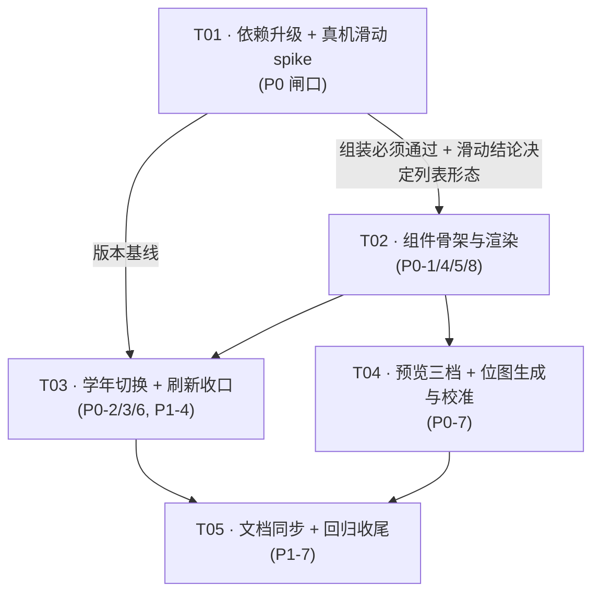

# 架构设计：新增「我的成果」桌面小组件（v1.5.0）

| 项 | 内容 |
| --- | --- |
| 文档版本 | **v1.2**（v1.1 → T01 实测闭环：**AGP 8.5.2 → 8.6.0 是第四件套**（Glance 1.2.0 的 AAR metadata 硬下限，v1.0/v1.1 漏记）；补充§6.2 联动下限核查、§6.3 升级顺序；W 编号统一到 **W1–W6**（W6 = 冷启兜底）；新增 R19/R20） |
| 日期 | 2026-09-25 |
| 作者 | 高见远（Architect） |
| 项目 | `zongce-android`（暨存 · Android，package `com.zongce.app`） |
| 上游输入 | `docs/prd/prd-成果小组件-v1.5.0-2026-09-25.md`（PM：Alice） |
| 技术预研 | 2026-09-25《Glance 1.1.0 组件五项技术问题预研结论》（源码 / 官方文档实证） |
| 发版版本 | **v1.5.0 / versionCode 1000014 —— 待用户确认**（team-lead 明确保留） |
| 配套图 | `widget-achievement-class-diagram.mermaid`、`widget-achievement-sequence-diagram.mermaid` |

> **命名说明**：仓库 `docs/design/` 里已有 `class-diagram.mermaid` / `sequence-diagram.mermaid` / `system_design.md`，那是**另一条工作流**的产物。为避免覆盖，本次两张图用带前缀的新文件名。
> **工作区说明**：本次只做新增文件与只读分析，不动任何既有改动（`CODE_STRUCTURE.md`、ViewModel 拆分等）。

---

## Part A · 系统设计

### 1. 实现方案

#### 1.1 需求与难点拆解

原始需求四条：**① 新增组件；② 组件内选学年；③ 内容实时更新；④ 列表可滑；⑤ 选择器里看到真实样子。** 真正的技术难点不在「画界面」，而在下面四个**不能靠读文档消除的不确定性**：

| # | 难点 | 为什么难 | 本次解法（对应章节） |
| --- | --- | --- | --- |
| N1 | **列表能否滑动不可控** | Glance `LazyColumn` 底层是 RemoteViews 集合视图（ListView），能否滚动由 **launcher（AppWidgetHost）** 是否放行垂直手势决定，App 侧无法强制。本项目 **v1.3.5 就因 ColorOS 集合视图兼容差异回退过一次** | §1.4 三层降级 + T01 真机 spike 先行 |
| N2 | **预览到底能做到什么程度** | 系统 `previewLayout` / `previewImage` 是**静态资源**，渲染发生在 launcher 进程、App 未必跑过 → **静态预览不可能显示真实记录**。要真实数据必须 Android 15+ 的 generated preview（仅 Glance 1.2.0+ 提供） | §1.5 三档预览（静态位图 + 静态 XML + API 35+ 真实推送） |
| N3 | **学年状态源分裂** | v1.3.6 修的就是这个 bug（App 内内存状态 vs 组件读 SP 两份）。现有 `AchievementYearStore` 是唯一事实源 | §1.3 一切学年读写经同一 store，且经同一个串行写入器 |
| N4 | **刷新链路会漏挂** | 写路径分散在 5 处，漏挂 = 桌面停在旧值**且不报错**（ADR-0002 称之为"隐性约束"） | §1.6 单一入口 `WidgetRefresh.refresh()` + 空 Added early-return |

#### 1.2 技术选型（每一条都给出依据）

| 选型 | 决定 | 依据 |
| --- | --- | --- |
| UI 框架 | **Glance `LazyColumn`**（非传统 RemoteViews + `RemoteViewsService` 手写） | 1.1.0/1.2.0 的 `androidx.glance.appwidget.lazy.LazyColumn` **不是实验性 API**（源码 `LazyList.kt`：常规重载无 `@ExperimentalGlanceApi`，只有 `activityOptions` 重载才有）→ **无需 `@OptIn`**；与 App 内同栈 Compose，省掉一整套手写 RemoteViews XML |
| Glance 版本 | **1.1.0 → 1.2.0** | 只有 1.2.0 才有 `GlanceAppWidget.providePreview` / `previewSizeMode` / `GlanceAppWidgetManager.setWidgetPreviews()`。1.1.0 全仓 grep **0 命中**（源码实证）。release note 原文：*"Add Glance APIs for generated previews… (Iced16)"*，1.2.0 于 2026-08-26 转 stable |
| **绝不升级到 1.3.0-alpha** | release note 与 AAR metadata **双向背书**：release note 写 *"Updated Compose compileSdk to API 37 → minimum AGP 9.2.0"*；**实测 `1.3.0-alpha01` 的 `minAndroidGradlePluginVersion=9.1.0` / `minCompileSdk=37`**（见 §6.1 sweep 表） | 本项目 **AGP 8.6.0 / compileSdk 35**，两条都不满足 → **会直接把构建打挂**（R9） |
| 列表集合机制 | Glance 内部按 SDK 分叉：`SDK_INT > 31` → `RemoteCollectionItems` **一次性推送全部 item**；`<= 31` → `GlanceRemoteViewsService` Intent 路 + `notifyAppWidgetViewDataChanged` | 源码 `GlanceRemoteViewsService.kt:237`。因此 **API 32+ 必须限制条目数**（Binder 事务大小），故 `WIDGET_MAX_ROWS = 20` |
| 状态存储 | **SharedPreferences（`AchievementYearStore`），不用 `PreferencesGlanceStateDefinition`** | ① Glance state 是**每个 appWidgetId 一份 DataStore**（`createUniqueRemoteUiName(appWidgetId)`），会分裂成"桌面一份、成果页一份"；② **`providePreview` 没有 GlanceId、读不到实例状态**，只有全局 SP 能在预览里取到真实数据；③ 成果页已在用，`AcademicYear` 口径单一 |
| 点击回调 | `actionRunCallback<SwitchYearAction>` + `ActionCallback` | `onAction` 是 suspend，跑在 **`Dispatchers.Default` 后台线程池**（源码 `CoroutineBroadcastReceiver.goAsync` 默认参数是 `Dispatchers.Default`）→ 可直接 await Room suspend DAO。受广播 `goAsync()` 窗口约束（~10s），本次只是读写 SP + 一次轻量查询，远在预算内 |
| 刷新机制 | 主动推送（`updateAll`）+ 生命周期兜底，`updatePeriodMillis = 0` | `AppWidgetProviderInfo.updatePeriodMillis` javadoc 原文：*"Updates requested with updatePeriodMillis will not be delivered more than once every **30 minutes**."* → 轮询不可能做到"实时/实时"；ADR-0002 已评估并拒绝 |
| 预览应用层 | `previewImage`（全版本）+ `previewLayout`（API 31+）+ generated preview（API 35+） | 官方「Add previews to your widget picker」原文推荐："*provide a generated widget preview on Android 15 and later devices, a **scaled widget preview (previewLayout)** for Android 12 to Android 14 devices, and a **previewImage** for earlier versions*" |

#### 1.3 学年（单一事实源 + 串行写入）

**这是本次唯一允许组件写的东西**，也是最容易复发历史 bug 的地方，必须按唯一通道走：

```
         成果页 chip 点击                组件 ‹ › 箭头点击
                 \                            /
                  v                          v
        RecordViewModel.saveAchievementYear()   SwitchYearAction.onAction()
                 \                            /
                  \______ 都转入 App 进程唯一写入器 ______/
                                  |
                   AchievementYearWriter.writeAndRefresh(context, year)
                                  |  (单消费者 Channel，严格按入队顺序串行执行)
                    ① AchievementYearStore.set(app, year)     // SP 同步 commit
                    ② WidgetRefresh.refresh(app)              // 推桌面重渲染
```

**为什么必须引入 `AchievementYearWriter` 这个串行写入器（即使 VM 里已经有一个队列）：**

`RecordViewModel` 现有的单消费者 Channel 只能串行化**它自己**的点击。组件箭头是另一个独立写入源：每次点击各起一个 `goAsync` 协程跑在 `Dispatchers.Default` **多线程池**上，**连点 3 次箭头的三次写盘没有顺序保证** → 最终落盘的未必是最后点的学年。这正是 v1.3.6 修过的那类并发坑（VM 注释原文："*Dispatchers.IO 是多线程池…坏交错下后点的先执行、先点的后执行，最终落盘的反而是先点的那个*"），只是触发源从 chip 换成了箭头。

因此：
- **不拆掉** VM 现有的队列（它是 v1.3.6 的修复本体，且 team-lead 明确要求 W5 必须挂在它里面），只把队列消费者里的那行 `AchievementYearStore.set(...)` 换成调用共享写入器；
- 组件箭头走同一个写入器，于是**两条写入源共用一条串行流水线**，跨源顺序也有保证；
- 用 **Channel + `CompletableDeferred`**（与 VM 现有写法同款），不依赖 `Mutex` 的公平性语义——顺序保证是显式的、可读的。

#### 1.4 列表：三层降级（滚动是增强，不是依赖）

| 层 | 触发 | 形态 | 代码开关 |
| --- | --- | --- | --- |
| **L1** | 默认（spike 通过） | `LazyColumn`，最多 `WIDGET_MAX_ROWS = 20` 条，每条 `itemId = record.id` | `AchievementWidget.USE_LAZY_COLUMN = true` |
| **L2** | 常驻（与 L1/L3 并存） | 列表区之后固定一行 **「共 X 条 · 查看全部」**，`clickable → WidgetActions.OPEN_ACHIEVEMENT`。列表溢出的那部分内容靠这一跳进 App 兜住 | 无条件渲染 |
| **L3** | spike 判定某 launcher 不支持滚动 | 翻 `USE_LAZY_COLUMN = false`，改用静态 `Column`，行数由 `LocalSize.current.height` 算（见 §3.4 公式），底部仍是 L2 那一行 | 编译期常量 |

> **L2 为什么常驻**：即便 L1 一切正常，**也不能假设用户会去滑**。底部那行既是"还能看更多"的显式入口，也是 N1 风险在 UI 上的保险丝。
> **硬约束**：列表内**绝不出现照片缩略图**（PRD B-3 / P2-3）——API 32+ 全部 item 一次性进 Binder 事务，官方 `RemoteViews.setRemoteAdapter(viewId, RemoteCollectionItems)` javadoc 明确警示 "*as long as the total memory within the list of RemoteViews is relatively small (ie. doesn't contain large or numerous Bitmaps)*"。
> **每条 item 必须是单个 Row/Column 根节点**，不要在 item 上设对齐 —— Glance 源码 `LazyListTranslator` 里 `require(children.size == 1 && alignment == Alignment.CenterStart)` 会直接抛异常。
> **不支持嵌套列表**（源码 `check(!isLazyCollectionDescendant) { "Glance does not support nested list views." }`）。

#### 1.5 预览：三档组合（D4 进取路线）

**Android 15+ 且支持的 launcher**：优先 Generated Preview（App 主动推送，**候选 fiber 里显示的是带真实学年/真实记录数的组件**）； API 12–14 或 15+ 不支持的选择器：退回静态资源。三档共存在同一份 `appwidget-provider` XML 上：

| 档 | 属性 / API | 作用对象 | 关键约束 |
| --- | --- | --- | --- |
| **L1 保底** | `android:previewImage="@drawable/widget_preview_achievement_img"` | **全版本**；**ColorOS「原子组件」选择器的唯一可用路径**（本项目 `jicun_widget_info.xml` 注释已记录：该选择器不渲染 previewLayout，会回落到应用图标） | `drawable-nodpi` 位图 **750×750 px**（250×250dp @3x），由 `tmp/gen_widget_previews.py` 的 `gen_achievement()` 生成 |
| **L2 增强** | `android:previewLayout="@layout/widget_preview_achievement"` | API 31+ 支持该属性的 launcher；优先级高于 previewImage（`AppWidgetProviderInfo.previewLayout` javadoc：*"If supplied, this will take precedence over the previewImage **on supported widget hosts**"*) | **必须单独一份 XML，且里面绝不能放 ListView** —— 集合数据是运行时注入的，预览里会渲染成空列表。官方「Build accurate previews that include dynamic items」要求用 **LinearLayout 假造若干行** |
| **L3 真实** | `providePreview()` + `GlanceAppWidgetManager.setWidgetPreviews()` | Android 15+（`@RequiresApi(VANILLA_ICE_CREAM)`） | ① **必须 override `previewSizeMode = SizeMode.Responsive`**（默认 `SizeMode.Single` 只按 minWidth/minHeight 渲染，**会把列表裁掉**，官方 troubleshooting 点名的坑）；② **限流约每小时 2 次** → 必须 fingerprint 判重 + 最小间隔节流 |

> **诚实边界（要同步给用户）**：L1/L2 是静态资源，**不可能显示真实记录**。我们保证的是版式 / 配色 / 文案结构与真实组件 1:1 + 3 条真实感示例数据。L3 才能让 API 35+ 的选择器显示真实学年与真实条数。

#### 1.6 刷新：单一入口 + 六条写路径（W1–W6，编号与 ADR-0003 一致）

```kotlin
object WidgetRefresh {
    suspend fun refresh(context: Context) {           // 全仓唯一入口
        val app = context.applicationContext
        val manager = GlanceAppWidgetManager(app)
        val ids = runCatching { manager.getGlanceIds(AchievementWidget::class.java) }
            .getOrElse { emptyList() }
        if (ids.isEmpty()) return                     // 没加过组件：不查库、不传 RemoteViews
        runCatching { AchievementWidget().updateAll(app) }   // 绝不向上抛
            .onFailure { Log.w(TAG, "widget refresh failed", it) }
    }
}
```

**为什么里面的 `runCatching` 不是可选的**：W1–W6 的六个调用点都在业务主干上（尤其 W1–W5 的删除路径），组件刷新是**旁路**；它一旦抛异常就会污染删除结果提示（"删除失败"假象）。刷新失败最坏结果只是桌面暂时旧，必须降级而非传播。

**必须挂刷新的 6 条写路径（W1–W6，按文件 + 函数名锁死；编号与 ADR-0003 D2 逐字对应）**

| # | 写路径 | 文件 / 函数 | 插入点（精确） |
| --- | --- | --- | --- |
| W1 | 保存 / 编辑记录（含移除旧照片） | `ui/RecordViewModel.kt` → `saveRecord(record, newUris, removedIds, onSaved)` | `viewModelScope.launch(Dispatchers.IO)` 块内、`withContext(Dispatchers.Main) { onSaved(failures) }` **之前** |
| W2 | 单条删除 | `ui/RecordViewModel.kt` → `deleteRecord(item)` | `try { … reportDeletion(...) ; WidgetRefresh.refresh(...) } catch … finally { finishDeletion() }` —— 在 **`finishDeletion()` 之前** |
| W3 | 多选删除 | `ui/RecordViewModel.kt` → `deleteSelected(ids)` | `exitSelectionMode()` 之后、`finishDeletion()` 之前 |
| W4 | 整学年删除 | `ui/RecordViewModel.kt` → `deleteYear(year)` | `reportDeletion(...)` 之后、`finally {}` 之前 |
| W5 | **App 内切学年**（v1.3.6 遗留链路补齐） | `ui/RecordViewModel.kt` → `init{}` 里的**单消费者协程**（`achievementYearRequests` 的消费者） | `AchievementYearStore.set()` 那一行改为调用 `AchievementYearWriter.writeAndRefresh()`；**严禁裸 `launch(Dispatchers.IO)`** |
| **W6** | **冷启兜底**（不是写路径，补的是上面四条刷新的空窗） | `ui/MainActivity.kt` → `onCreate` | `lifecycleScope.launch(Dispatchers.IO) { WidgetRefresh.refresh(applicationContext) }`；配套 `WidgetPreviewPublisher.publishIfChanged()` |

> **W1–W5 是「写路径」**（数据变了必须推），**W6 是「兜底」**（数据没变也可能已陈旧）。两者因果不同，但走同一个入口 —— **不要因为"App 升级 / 重启不是写路径"就省掉 W6**：源码实证 `MY_PACKAGE_REPLACED` 到桌面组件之间只有 `cleanReceivers()`，没有 update，漏了 W6 的表现不是报错，而是"桌面长期停在旧值，且日志里没有任何线索"。

**组件自身生命周期 / 兜底刷新**（依据源码实证）：

| 时机 | 谁做 | 依据 |
| --- | --- | --- |
| 组件添加 / 桌面尺寸变化 | Glance 自动（`onUpdate` / `onAppWidgetOptionsChanged` 均已 override） | 源码 `GlanceAppWidgetReceiver.kt:94 / :113` |
| 组件删除 | Glance 自动（`onDeleted` → `deleted()`） | 源码 `:126` |
| App 升级 | **Glance 只清理不刷新** —— `MyPackageReplacedReceiver` 收到 `MY_PACKAGE_REPLACED` 后只调 `cleanReceivers()` | 源码 `MyPackageReplacedReceiver.kt` |
| 设备重启 | **无自动刷新机制**，会重建组件但先显示 `initialLayout` | 无源码 / 文档承诺 |
| **App 冷启（= W6）** | `MainActivity.onCreate` → `lifecycleScope.launch(Dispatchers.IO) { WidgetRefresh.refresh(applicationContext) }` | 覆盖"App 升级"与"设备重启"两个空窗 |
| App 回前台兜底（P1-3） | `MainActivity` `ON_RESUME` | 覆盖"推送因进程被杀没送到" |

#### 1.7 `provideGlance` 是挂起函数意味着什么（写给 Engineer 的红线）

源码 `GlanceAppWidget.kt` KDoc 原文（翻译）：

> `provideGlance` 在后台以 **`androidx.work.CoroutineWorker`** 的形式响应 `update`/`updateAll` 与 Launcher 请求。调用 `provideContent` **之前**受 WorkManager 正常时限（**当前十分钟**）；调用之后 composition 继续运行并可重组约 **45 秒**；收到交互 / 更新请求会追加时间。
> **注意：`update` / `updateAll` 不会重启正在运行的 `provideGlance`。** 因此应在 `provideContent` **之前**加载初始数据；从别处改了数据源后**必须调用 `update`**。

落地三条：

1. **查库可以直接 await**（背景 Worker，10 分钟预算），不需要自己起 Worker，也不需要额外 `withContext` 包装 IO 之外的东西（但我们仍显式 `withContext(Dispatchers.IO)` 表明意图，对齐 P1-8 的性能约束）。
2. **别指望 composition 长期存活去监听 Flow**（只活 ~45 秒），所以不做 Room 流式订阅，只做一次快照读。
3. **改完必须 `update`** —— 包括 `SwitchYearAction` 里（见下方红线）。

> ### 🚩 红线注释（必须原样写进 `SwitchYearAction.kt`）
> ```
> // ⚠️ ActionCallback 执行完 Glance **不会自动刷新组件**。
> // 源码实证：ActionCallbackBroadcastReceiver.onReceive 里只有
> // `RunCallbackAction.run(...)`，调用结束后没有任何 update。
> // 漏掉下面的 update() = 点了没反应，而且不报错、不崩溃、日志里也没有线索。
> ```

---

### 2. 文件清单

#### 2.1 新增文件

| 路径 | 职责 |
| --- | --- |
| `app/src/main/java/com/zongce/app/widget/AchievementWidget.kt` | 组件本体：`provideGlance` / `providePreview` / `sizeMode` / `previewSizeMode` / 组合式 UI |
| `app/src/main/java/com/zongce/app/widget/AchievementWidgetReceiver.kt` | `GlanceAppWidgetReceiver` 子类，挂 `glanceAppWidget` |
| `app/src/main/java/com/zongce/app/widget/AchievementWidgetLoader.kt` | 数据装载快照（一次查询 + 学年归属 + 统计 + 截断），含失败降级 |
| `app/src/main/java/com/zongce/app/widget/WidgetPalette.kt` | 组件专用写死色值与五育色点常量（Kotlin `Color`） |
| `app/src/main/java/com/zongce/app/widget/SwitchYearAction.kt` | `‹ ›` 箭头的 `ActionCallback` |
| `app/src/main/java/com/zongce/app/widget/WidgetRefresh.kt` | **刷新单一入口** |
| `app/src/main/java/com/zongce/app/widget/WidgetPreviewPublisher.kt` | API 35+ generated preview 推送 + fingerprint 判重 + 限流节流 |
| `app/src/main/java/com/zongce/app/data/AchievementYearWriter.kt` | 学年写入的**进程级串行写入器**（供 VM 队列与组件箭头共用） |
| `app/src/main/res/xml/jicun_achievement_widget_info.xml` | AppWidgetProviderInfo |
| `app/src/main/res/layout/widget_preview_achievement.xml` | 预览专用 XML（**静态 LinearLayout 假行**，不放 ListView） |
| `app/src/main/res/drawable/widget_preview_achievement_bg.xml` | 预览 XML 用的圆角卡片底 |
| `app/src/main/res/drawable/widget_preview_achievement_tile.xml` | 预览 XML 用的统计行浅蓝底 + 圆角 |
| `app/src/main/res/drawable-nodpi/widget_preview_achievement_img.png` | 预渲染位图（生成物，750×750） |
| `docs/adr/0003-widget-achievement-readonly-and-refresh.md` | 新 ADR（**路径以 team-lead 指定为准**）。ADR-0002 保持 Deprecated 不复活。起草：许清楚；口径复核：高见远 |
| `docs/design/widget-achievement-design-v1.5.0-2026-09-25.md` | 本文 |
| `docs/design/widget-achievement-class-diagram.mermaid` | 类图 |
| `docs/design/widget-achievement-sequence-diagram.mermaid` | 时序图（两条主链路） |
| `tmp/widget_preview_calibrate.py` | adb 真机截图 → 裁到 750×750 → 校准位图的辅助脚本 |

#### 2.2 修改文件（精确清单）

| 路径 | 改动 |
| --- | --- |
| `build.gradle.kts`（根） | Kotlin 插件 `2.0.20 → 2.0.21`；KSP `2.0.20-1.0.25 → 2.0.21-1.0.25`（已核实后者在 Maven Central 存在） |
| `app/build.gradle.kts` | Glance `1.1.0 → 1.2.0`；Compose BOM `2024.09.02 → 2025.02.00` |
| `app/src/main/AndroidManifest.xml` | 新增 `.widget.AchievementWidgetReceiver`（`exported=false` + `APPWIDGET_UPDATE` + `meta-data`） |
| `app/src/main/res/values/strings.xml` | 新增 `achievement_widget_label`（暨存 · 我的成果）/ `achievement_widget_description`，以及组件内文案（"Achievement 组件里不让用 private const 硬编码中文，统一走 string 资源"） |
| `app/src/main/java/com/zongce/app/ui/RecordViewModel.kt` | **W1/W2/W3/W4** 四处挂 `WidgetRefresh.refresh()`；`init{}` 队列消费者改用 `AchievementYearWriter`（**W5**） |
| `app/src/main/java/com/zongce/app/ui/MainActivity.kt` | `onCreate` 追加冷启兜底刷新（**W6**）+ `WidgetPreviewPublisher.publishIfChanged()` |
| `tmp/gen_widget_previews.py` | 新增 `gen_achievement()` 分支并挂进 `main()` 的循环 |
| `VERSION_HISTORY.md` / `CODE_STRUCTURE.md` / `README.md` | 文档同步（P1-7；⚠️ 与他人既有改动同文件，**只追加、不覆盖**） |

#### 2.3 不改文件（边界）

`widget/JicunWidget.kt`、`widget/JicunWidgetReceiver.kt`、`res/xml/jicun_widget_info.xml`、`res/layout/widget_preview_entry.xml`、`core/AcademicYear.kt`、`ui/AchievementScreen.kt`、`data/RecordDeletion.kt`、Room 实体与 schema —— **一字不动**。

---

### 3. 数据结构与接口

#### 3.1 类图

见 `widget-achievement-class-diagram.mermaid`（可直接在任意 Mermaid 渲染器打开）。

#### 3.2 关键数据结构

```kotlin
/** 组件一次渲染所需的全部数据 —— provideGlance 与 providePreview 共用同一份装载结果。 */
data class AchievementWidgetSnapshot(
    val years: List<String>,        // AcademicYear.yearsOf(全部日期)，恒含 LABEL，降序
    val year: String,               // AchievementYearStore.current()，已回落过的安全值
    val recordCount: Int,           // 该学年条数
    val coveredWuyu: Int,           // 该学年覆盖几育
    val rows: List<AchievementWidgetRow>,   // 已排序 + 已截断 ≤ WIDGET_MAX_ROWS
    val hasMore: Boolean            // 是否超出上限（决定 L2 文案）
) {
    companion object { val FALLBACK = AchievementWidgetSnapshot(...) }  // 查库失败用
}

data class AchievementWidgetRow(
    val id: Long,        // = record.id，用作 LazyColumn 的 itemId（稳定 id，保留滚动位置）
    val name: String,    // awardName.ifBlank { "未填写获奖名称" }
    val subline: String, // "五育 · 日期 · 等级"，listOfNotNull + joinToString(" · ")
    val wuyuColor: Int   // 主题-independent：從 WidgetPalette 取 ARGB
)
```

#### 3.3 核心接口签名

```kotlin
// ---------- 组件本体 ----------
class AchievementWidget : GlanceAppWidget() {
    override val sizeMode: SizeMode = SizeMode.Responsive(
        setOf(DpSize(250.dp, 180.dp), DpSize(250.dp, 250.dp), DpSize(320.dp, 250.dp))
    )
    override val previewSizeMode: PreviewSizeMode = SizeMode.Responsive(   // ★ 默认 Single 会裁列表
        setOf(DpSize(250.dp, 180.dp), DpSize(250.dp, 250.dp), DpSize(320.dp, 250.dp))
    )
    override suspend fun provideGlance(context: Context, id: GlanceId)
    override suspend fun providePreview(context: Context, widgetCategory: Int)   // 单次组合，无 GlanceId
    override fun onCompositionError(context, glanceId, appWidgetId, throwable)
}

// ---------- 数据装载（只读） ----------
object AchievementWidgetLoader {
    suspend fun load(context: Context): AchievementWidgetSnapshot   // 内部 runCatching → FALLBACK
}

// ---------- 学年写入（进程级串行） ----------
object AchievementYearWriter {
    suspend fun writeAndRefresh(context: Context, year: String)     // 入队 + await 完成
}

// ---------- 刷新（唯一入口） ----------
object WidgetRefresh { suspend fun refresh(context: Context) }

// ---------- 预览推送 ----------
object WidgetPreviewPublisher {
    suspend fun publishIfChanged(context: Context)   // fingerprint 判重 + 最小间隔节流 + API>=35 守卫
}

// ---------- 交互 ----------
class SwitchYearAction : ActionCallback {
    override suspend fun onAction(context: Context, glanceId: GlanceId, parameters: ActionParameters)
}
```

#### 3.4 L3 静态降级时的行数公式（spike 失败才启用）

```
可用列表高度  listH = LocalSize.current.height - (12dp padding ×2) - 24dp(标题行) - 6dp - 44dp(统计行) - 6dp - 1dp(分隔线)
行数          rows  = max(1, floor(listH / 44dp))            // 行高 44dp；保底 1 行
              且     rows <= WIDGET_MAX_ROWS
```
4×4（250dp）→ listH ≈ 145dp → **3 行**；4×3（180dp）→ listH ≈ 75dp → **1 行**（PRD P1-6 要求"至少 1 行完整可见"成立）。

#### 3.5 数据装载口径（必须与成果页逐字一致）

```kotlin
withContext(Dispatchers.IO) {
    runCatching {
        val items = AppDatabase.get(app).awardDao().allWithPhotos().first()
        val years  = AcademicYear.yearsOf(items.map { it.record.awardDate })   // 恒含 LABEL，降序
        val year   = AchievementYearStore.current(app, years)                  // 同源 + 自动回落
        val ofYear = AcademicYear.inYear(items, year) { it.record.awardDate }
                        .sortedByDescending { it.record.awardDate }            // 排序在过滤之后
        // 统计：count = ofYear.size; covered = ofYear.map{it.record.wuyu}.distinct().size
        // 列表：ofYear.take(WIDGET_MAX_ROWS)
    }.getOrElse { AchievementWidgetSnapshot.FALLBACK }   // B-5 降级空态
}
```
**严禁**在组件里手写日期比较或 `awardDate.substring`（学年归属全仓只有 `AcademicYear` 一处实现）。

---

### 4. 程序调用流程

见 `widget-achievement-sequence-diagram.mermaid`，包含两条主链路：

- **场景 A —— 组件内点 ‹ › 切学年**：`AppWidgetHost` → `ActionCallbackBroadcastReceiver`（`goAsync`/`Dispatchers.Default`）→ `SwitchYearAction.onAction` → `AchievementYearWriter`（单消费者 Channel）→ 写 SP + `WidgetRefresh.refresh` → `AchievementWidget.updateAll` → WorkManager Session → `provideGlance` → 查库 → RemoteViews → `AppWidgetManager`。
- **场景 B —— App 内保存记录后刷新桌面**：`EntryScreen` → `RecordViewModel.saveRecord`（IO 协程）→ `WidgetRefresh.refresh` → （同尾部链路）→ 桌面更新；以及 App 冷启 `MainActivity.onCreate` 的兜底分支。

---

### 5. Anything UNCLEAR / 待确认

| # | 事项 | 现状 | 需要谁定 |
| --- | --- | --- | --- |
| U1 | **发版版本号 v1.5.0 / versionCode 1000014** | PRD 建议值，设计里原样保留 | **待用户确认**（team-lead 明确保留） |
| U2 | ~~`WIDGET_MAX_ROWS` 取 20 还是 30~~ | **已闭环**：PM 已将 PRD 升到 v1.1，§3.3 / P0-4 / P1-1 / §8 **四处全部改为 `WIDGET_MAX_ROWS = 20`**，并写明"不是懒加载，是硬上限"。PRD 与本设计口径一致 | ✅ 无需再定（保留此行用于追溯） |
| U3 | **桌面专属卡片：`previewImage` 尺寸 750×750** | 按 4×4 默认落地尺寸（250×250dp @3x）。若 launcher 的预览区横纵比不同系统会自行缩放 | 实施时按 PRD §4.1 口径执行即可 |
| U4 | ColorOS 最新版「原子组件」是否**已支持** previewLayout / 是否支持列表滚动 | 只有本项目 v1.3.5 的历史记录为证 | **T01 真机 spike 结论**（见 §8 T01 判定标准） |
| U5 | 是否需要为各 launcher 处理"列表区滑动与桌面拖动组件手势冲突" | launcher 行为，App 无法控制 | 归入风险 R1，降级兜底已在 L2/L3 覆盖 |

---

## Part B · 任务分解

### 6. 依赖清单（Required Packages）

> **v1.2 修订**：原 v1.0/v1.1 只写了"三件套"。T01 实测发现 **Glance 1.2.0 还隐含要求 AGP ≥ 8.6.0**，漏了这条会直接把 `:app:checkDebugAarMetadata` 打挂。现补为**四件套**，并把"怎么核查这类隐藏下限"固化成可执行命令（§6.1），把升级顺序固化为 §6.3。

```gradle
// —— 升级（必须四件套同时动，缺一件 = 构建失败或版本错配）——
// 根 build.gradle.kts
id("com.android.application") version "8.6.0" apply false                 // 8.5.2 → 8.6.0  【第四件套，见 §6.1】
id("org.jetbrains.kotlin.android") version "2.0.21" apply false           // 2.0.20 → 2.0.21
id("org.jetbrains.kotlin.plugin.compose") version "2.0.21" apply false    // 2.0.20 → 2.0.21
id("com.google.devtools.ksp") version "2.0.21-1.0.25" apply false         // 2.0.20-1.0.25 → 2.0.21-1.0.25

// app/build.gradle.kts
implementation(platform("androidx.compose:compose-bom:2025.02.00"))       // 2024.09.02 → 2025.02.00
implementation("androidx.glance:glance-appwidget:1.2.0")                  // 1.1.0 → 1.2.0
```

#### 6.1 为什么必须是这四件套（POM + AAR metadata 双实测）

**Glance 1.2.0 的三条下限**（前两条来自 POM，第三条来自 AAR metadata）：

| Glance 1.2.0 的下限 | 我们升级前 | 出处 | 结论 |
| --- | --- | --- | --- |
| `compose runtime` **1.7.8** | BOM 2024.09.02 → runtime **1.7.2** | POM | ❌ 不满足 → **必须升 BOM**；实测 `compose-bom-2025.02.00` 恰好对应 runtime **1.7.8**（2024.12.01/2025.01.00 都只有 1.7.6）。只升 Glance 会让 runtime 被单独抬到 1.7.8 而 `ui/material3` 留在 1.7.2，**Compose 家族版本错配** |
| `kotlin-stdlib` **2.0.21** | Kotlin 插件 2.0.20 | POM | ❌ 会被 Gradle 抬高 → 直接把插件对齐到 2.0.21（KSP 必须跟着走，见 §6.2） |
| **AGP ≥ 8.6.0** + `compileSdk ≥ 35` | AGP **8.5.2** / compileSdk 35 | **AAR metadata** | ❌ 原组合不满足 → **必须升 AGP**。实测输出见下 |

> **TL;DR：Glance 1.2.0 抬不动 AGP 的话，唯一出路是退回 Glance 1.1.0 + 预览只做 L1/L2（放弃 L3 "看到实际的样子"）**，那要砍 PRD P0-7，必须先过 PM 和用户。所以 AGP 这一件不是"顺手升"，是本次取舍的组成部分。

**复核命令（下次升任何依赖都照做一遍，别再只信 release note）**：

```bash
BASE=https://dl.google.com/dl/android/maven2
# 把 AAR 里的构建期元数据打出来：AGP 下限 + compileSdk 下限都在这里
curl -s -o g.aar $BASE/androidx/glance/glance-appwidget/1.2.0/glance-appwidget-1.2.0.aar \
  && unzip -p g.aar META-INF/com/android/build/gradle/aar-metadata.properties
# 实测输出：
#   minCompileSdk=35
#   minAndroidGradlePluginVersion=8.6.0
```

**全依赖 sweep 结论（本次实测，均为 AAR metadata 实测值）**

| 依赖 | AGP 下限 | compileSdk 下限 | 判定 |
| --- | --- | --- | --- |
| `androidx.glance:glance-appwidget` **1.2.0** | **8.6.0** | **35** | ⬆️ **本次唯一的 AGP 抬升来源** |
| `androidx.glance:glance-appwidget-preview` 1.2.0 | 8.6.0 | 35 | 与上行同一下限（T01 可选的 `debugImplementation`） |
| `androidx.glance:glance` 1.2.0（core，传递依赖） | 8.1.1 | 34 | 不构成约束 |
| `androidx.glance:glance-appwidget` 1.1.0 | 1.0.0 | 34 | 旧组合为什么一直没事 |
| `androidx.glance:glance-appwidget` **1.3.0-alpha01** | **9.1.0** | **37** | ⛔ **永久禁止**（release note 写 9.2.0、实测 metadata 9.1.0，两者都远超本项目；这条同时说明**不要只信 release note**） |
| compose `runtime-android` / `ui-android` / `ui-graphics-android` / `foundation*-android` / `material-icons-extended-android` 1.7.8 | 1.0.0 | 34 | AAR 层面无额外下限；它的约束在 **POM**（runtime 1.7.8），只能从 POM 看出来 |
| `activity-compose` 1.9.2 / `lifecycle-runtime-android` 2.8.6 / `navigation-compose` 2.8.1 / `core-ktx` 1.13.1 / `room-runtime` + `room-ktx` 2.6.1 | 1.0.0 | 34 | 无隐藏下限 |
| `work-runtime` 2.10.0（Glance 传递）/ `core` 1.15.0 | 1.0.0 | 35 | 无 AGP 下限；compileSdk 35 已满足 |

> **为什么 v1.0 预研会漏掉 AGP 这条**：当时只读了 **sources.jar + POM**。AGP 下限写在 AAR 的 `META-INF/com/android/build/gradle/aar-metadata.properties` 里，由 AGP 的 `checkDebugAarMetadata` task **在构建期**校验 —— 这是典型的"文档没写、构建时才报错"的联动项。**教训已固化为上面那条 curl 命令**：以后碰依赖大版本，先 sweep AAR metadata，再改 `build.gradle.kts`。

#### 6.2 AGP 8.6.0 的联动下限清理（一次性核干净）

| 项 | 结论 | 依据 |
| --- | --- | --- |
| **Gradle wrapper** | **不用动**。AGP 8.6 要求 Gradle **最低 8.7**，本仓 wrapper 正好 `gradle-8.7-bin.zip` | AGP 8.6.0 release notes 兼容性表（Min 8.7 / Default 8.7） |
| **不要往上跳** | AGP 8.7 要求 Gradle 8.9 → 会连 wrapper 一起拖进来，blast radius 变大。**停在 8.6.0** | 官方 AGP↔Gradle 对应表（8.6→8.7、8.7→8.9、8.8→8.10.2） |
| **JDK** | 要求 17；本仓 Java source/target 均为 17，CI 也是 temurin 17 → **不动** | AGP 8.6 兼容性表（JDK 17） |
| **SDK Build Tools** | AGP 8.6 要求 ≥ **34.0.0**；本机已装 34.0.0 / 35.0.0 / 36.1.0 / 37.0.0 → **不用装新的** | 本机 `E:\Android\Sdk\build-tools` 实测 |
| **compileSdk 35** | **仍可用**，且同时是**天花板**：AGP 8.6 支持的最高 API 就是 35。⚠️ 以后想把 compileSdk 抬到 36，必须先升 AGP | 同上，「The maximum API level that AGP 8.6 supports is API level 35」；另有官方兼容页：API 35 的最低 AGP 正是 8.6.0（双向印证 §6.1 的结论） |
| **KSP** | **不用单独动**。官方要求 KSP 版本必须以 Kotlin 版本开头，2.0.21 对应 `2.0.21-*`，现有 `2.0.21-1.0.25` 正是官方文档举例的那个组合。KSP 自身对 AGP **没有下限**，只有上限：KSP1 不支持 AGP 9.0+，我们用 8.6 远低于它 | developer.android.com「升级依赖项版本」原文；KSP README 关于 KSP1↔AGP 9 的说明 |
| **targetSdk / minSdk** | 不受影响（35 / 26） | — |
| `gradle.properties` 的 `android.suppressUnsupportedCompileSdk=35` | **保留不动**。它是 8.5 时代为了压制"recommend using a newer AGP to use compileSdk = 35"警告加的；升到 8.6 后**警告自然消失**，这行变成空操作。留着无害，**严禁在 T01 里顺手删**（多一个变量 = 多一次归因） | 该警告的成因为"AGP 测试过的最高 compileSdk < 35"；而 8.6.0 恰好是官方支持 35 的最低版本 |
| `gradle.properties` 的 `android.overridePathCheck=true` | **保留不动**。AGP 8.6 仍有效，只在 configure 阶段打一行 `The option setting 'android.overridePathCheck=true' is experimental` 警告 —— **8.5.2 时代就有，不是本次回归**，别误判 | 实测 + 该开关为实验期选项、8.6 未移除 |
| **CI（`.github/workflows/ci.yml` / `release.yml`）** | **不用改**。两份 workflow 都是 `temurin` JDK 17 + 用仓库自带 `gradlew`（Gradle 8.7），AGP 8.6.0 的两个前置条件都满足；AGP 版本写在 `build.gradle.kts` 里，CI 自动跟随 | 本机核对 workflow `java-version: '17'` 与 `./gradlew` 调用 |
| Room KSP 处理器 / 其余第三方插件 | 无 AGP 下限，无需动 | 见 §6.1 sweep |

**8.6.0 vs 8.6.1**：8.6.1 是补丁版（修 Dexer 不确定性、R8 `StackOverflowError` 等），本项目 release **未开混淆**（`isMinifyEnabled = false`），那些修复用不上。T01 已按 8.6.0 落地就**不再动**，省一次全量下载与重跑；若将来因故要回滚重做，可直接上 8.6.1（同样满足 ≥8.6.0 + Gradle 8.7）。

#### 6.3 升级顺序（给 Engineer 的操作口径）

**结论：分步做，四步三构建 —— 先 AGP，再 Kotlin+KSP，最后 Glance+BOM 同一刀。**

理由：AGP 报错最早（配置期 / `checkDebugAarMetadata`），单独第一步能秒归因；Kotlin 单独一步把"语言与编译插件"问题和"Compose 版本错配"问题分开；Glance 与 BOM 必须同一 commit，因为它们互为 POM 约束（见 §6.1）。

| 步 | 改什么 | 验证 | 失败时归属 |
| --- | --- | --- | --- |
| 1 | 只动 `com.android.application` **8.5.2 → 8.6.0** | `./gradlew :app:assembleDebug` | AGP / Gradle wrapper / build-tools / gradle.properties 问题 |
| 2 | `kotlin.android` 与 `kotlin.plugin.compose` **→ 2.0.21**（两个必须同时改，版本要一致）+ `ksp` → `2.0.21-1.0.25` | 同上 | Kotlin 语言插件 / KSP / Room 注解处理器问题 |
| 3 | Glance **1.1.0 → 1.2.0** 与 BOM **2024.09.02 → 2025.02.00**，**必须同一 commit** | 同上 | 依赖错配 / Compose 家族版本错配 / AAR metadata 下限 |
| 4 | `./gradlew :app:testDebugUnitTest`（97 用例）+ §8.1 全部 UI 冒烟（**11 项**，含针对 AGP 的第 10/11 项） | — | — |

两条硬约束：

- **每一步跑之前/之中只允许存在一个 Gradle 构建**（见下方警示）。
- **回滚按逆序**：先回滚第 3 步（BOM+Glance）→ 第 2 步（Kotlin+KSP）→ 第 1 步（AGP）；每回滚一步重跑同一步的验证命令，确认回到绿，再决定要不要继续退。

> ### ⚠️ 并发构建警示（本次 T01 实测踩到）
> 同一台机器上**两个 Gradle 构建同时跑同一个项目**（两个 `GradleWrapperMain` 实例 —— 常见于"IDE 在 Gradle Sync + 命令行在构建"，或上一次构建没真正退出留下僵尸进程）会互相抢文件锁，典型症状：
> `Could not move temporary workspace ...` / `Timeout waiting to lock ...` / `File hash cache ... could not be moved`。
>
> **这不是"重跑一次就好"的那类错**：不先清掉冲突进程，重跑多少次结果都一样。处置顺序必须是：
> ① 确认没有第二个构建在跑（Windows：`jps`，或任务管理器找 `GradleWrapperMain` / `KotlinCompileDaemon`；IDE 里先看 Gradle Sync / Build 是否在进行）→ ② 结束掉多余的 → ③ 再重跑。
> 本机曾用 `-o`（offline）或多次重跑试图绕过，反而拖长了归因时间。请把它当作**环境问题第一排查项**，而不是构建脚本问题。

**不需要新增的**：`glance-appwidget-preview` / `glance-material3` / `glance-appwidget-testing` **已经是 `glance-appwidget` 的传递 compile 依赖**（1.1.0 POM 实测；1.2.0 同理）。本设计**不新增任何第三方库**（PRD B-7），只在 T01 可选地显式声明 `debugImplementation("androidx.glance:glance-appwidget-preview:1.2.0")` 便于 IDE `@Preview`（同样受 AGP ≥ 8.6.0 约束，见 §6.1）。

### 7. 任务列表（按依赖顺序，≤5）

---

#### **T01 · 依赖升级 + 真机滑动 spike（前置闸口）** · P0 · 依赖：无

> **对应 PRD v1.1 新增的 P0-9（官方依赖对齐升级）**，其验收标准已并入下列子步骤：升级单独一个 commit、`testDebugUnitTest` 现有 97 用例全绿 + `assembleDebug`、真机过五个 tab、回归不过的兜底 = 砍 L3 退回 1.1.0。

**目的**：先把两个不可控项做掉 —— ① **四件套**升级能否过编译；② Glance `LazyColumn` 在目标 launcher 上到底能不能滑。**T01 不通过 → T02/T03 的列表形态改写，且需求交付方式变更。**

**文件**
- 新增 `tmp/glance_spike_checklist.md`（spike 判定标准 + 结论落盘模板）
- 修改 `build.gradle.kts`（根）：**AGP 8.5.2 → 8.6.0** + Kotlin 2.0.21 + KSP 2.0.21-1.0.25（AGP 是 Glance 1.2.0 的硬性下限，见 §6.1）
- 修改 `app/build.gradle.kts`：Glance 1.2.0 + Compose BOM 2025.02.00
- **不改** `gradle/wrapper/gradle-wrapper.properties`（Gradle 8.7 已满足 AGP 8.6 下限，见 §6.2）、**不改** `gradle.properties`（`suppressUnsupportedCompileSdk` / `overridePathCheck` 均保留原值）
- 临时新增 `app/src/main/java/com/zongce/app/widget/SpikeWidget.kt`、`SpikeWidgetReceiver.kt`、`app/src/main/res/xml/spike_widget_info.xml`（最小 Glance 组件：只放一个 20 行文本的 LazyColumn）
- 修改 `app/src/main/AndroidManifest.xml`（临时注册 spike receiver）
- **收尾删除**上述 3 个临时文件 + manifest 条目（spike 结论写进 checklist 后即删，**不得随发布版本带上桌面的组件列表**）

**子步骤**

**A. 依赖升级（严格按 §6.3 分步，每步一次构建；构建前先确认机器上没有其他 Gradle 在跑）**

0. 前置自检：① `jps` 无残留 `GradleWrapperMain` / `KotlinCompileDaemon`；② JDK 17；③ build-tools ≥ 34.0.0 已装；④ wrapper = Gradle 8.7。任一条不满足先解决再进入下一步。
1. **只改 AGP → 8.6.0**，`./gradlew :app:assembleDebug` 必须绿。
2. **改 Kotlin + KSP → 2.0.21（两个 Kotlin 插件同时改）/ 2.0.21-1.0.25**，再构建一次。
3. **同时改 Glance → 1.2.0 与 BOM → 2025.02.00**（必须同一 commit），再构建一次。
   - 任一步失败 → 按 §6.3 逆序回滚定位；**不要一次改四项再去找是哪一项**（本次实测就是这么踩的：AGP 下限和并发抢锁两个问题同时出现，多花了归因时间）。
4. `./gradlew :app:testDebugUnitTest`：现有 97 个用例全绿。
5. 改版本单独一个 commit（P0-9 要求）。

**B. 回归冒烟 + 真机 spike**

6. 按 §8.1 全部 UI 冒烟（**11 项**）逐条走一遍 → 通过才继续。
7. 装到 **① 一台 ColorOS/OPPO 真机 + ② 一台原生/类原生（API 31+）**，桌面添加 spike 组件。
8. **判定标准（写进 checklist，逐条打勾）**：
   - [ ] 列表行数 ≥ 5 行可见；
   - [ ] 手指向上/向下**能连续滚动**，且**不误触发启动 App**、不触发桌面拖动组件；
   - [ ] 条目文字不截断、不串行、不重叠；
   - [ ] 组件**缩到最小高度**后仍至少显示 1 行且可滚；
   - [ ] 两种 launcher 上分别录制 10 秒录屏作为验收物。
9. **结论分支**：全部通过 → `AchievementWidget.USE_LAZY_COLUMN = true`（默认）；任一 launcher 失败 → 置 `false` 启用 §3.4 的 L3 静态行数方案，并把结论原样抄进 ADR-0003 的"为什么组件里不用 LazyColumn"一节。
10. **回填两份结论表**（两张表字段固定，回填时**只填空、不改表结构**）：
    - `tmp/glance_spike_checklist.md` 的**依赖升级表**：AGP / Kotlin / KSP / BOM / Glance 五项的旧值、新值、`assembleDebug` 是否绿、97 用例是否绿、备注（team-lead 要求：字段要够实施者直接填空，不需要再改散文）。
    - ADR-0003 文末「**T01 真机 spike 结论回填表**」（许清楚起草、字段已扩到 8 列）：按该表上方『判定口径』逐项填机型/launcher 与 `USE_LAZY_COLUMN` 结论；**降级结论以该表『结论』列为准，不在正文另写附注**。

> ⚠️ 顺手修一处会误导后人的注释：`app/build.gradle.kts` 里 Glance 依赖上方那句"本项目是 **AGP 8.5.2** / compileSdk 35"在本次升级后已失效，T01 里一并改成 **AGP 8.6.0**（结论不变：1.3.0-alpha 仍然禁止，因为它要 AGP 9.1.0+ / compileSdk 37，见 §6.1）。

**卡住的下游**：T02（列表形态）、T03（无依赖，仅按 T02 结果写、不受 spike 结论影响渲染形态）、T04（preview XML 里要不要模拟可变行数）。

---

#### **T02 · 组件骨架与渲染（P0-1 / P0-4 / P0-5 / P0-8）** · P0 · 依赖：T01

**文件**
- 新增 `widget/AchievementWidget.kt`（含 `sizeMode` / `previewSizeMode` / `provideGlance` / `onCompositionError` / `USE_LAZY_COLUMN` 开关）
- 新增 `widget/AchievementWidgetReceiver.kt`
- 新增 `widget/AchievementWidgetLoader.kt`（快照装载 + `runCatching` 降级）
- 新增 `widget/WidgetPalette.kt`（写死色值 + 五育色点）
- 新增 `res/xml/jicun_achievement_widget_info.xml`（4×4：targetCell 4/4、minWidth 250dp、minHeight 180dp、resizeMode horizontal|vertical、updatePeriodMillis 0、initialLayout `@layout/glance_default_loading_layout`）
- 修改 `AndroidManifest.xml`（第二个 receiver）、修改 `res/values/strings.xml`（label / description / 组件内文案）

**要点**
- **`sizeMode` 必须是 `SizeMode.Responsive`**（≥2 个 DpSize），不能用默认 `SizeMode.Single`。
- 列表 item **单根节点**；`itemId = row.id`；**无缩略图**；上限 `WIDGET_MAX_ROWS = 20`。
- L2 底部行「共 X 条 · 查看全部」→ `actionStartActivity(Intent(this, MainActivity).setAction(WidgetActions.OPEN_ACHIEVEMENT).addFlags(FLAG_ACTIVITY_NEW_TASK))`，**零新增路由**。
- 空态保留统计行 + 空态文案，**整块可点**进 App。
- 色值以 §9 共享知识为准（`#1B2430` 统一口径）。

---

#### **T03 · 学年切换 + 刷新收口（P0-2 / P0-3 / P0-6 / P1-4）** · P0 · 依赖：T02

**文件**
- 新增 `widget/SwitchYearAction.kt`（🚩 含 §1.7 红线注释）
- 新增 `widget/WidgetRefresh.kt`（唯一入口；`getGlanceIds` 判空早退；全程 `runCatching` 不抛）
- 新增 `data/AchievementYearWriter.kt`（单消费者 Channel + `CompletableDeferred`，进程级串行）
- 修改 `ui/RecordViewModel.kt`：**W1** `saveRecord` / **W2** `deleteRecord` / **W3** `deleteSelected` / **W4** `deleteYear` / **W5** `init{}` 队列消费者
- 修改 `ui/MainActivity.kt`：**W6** `onCreate` 冷启兜底 `WidgetRefresh.refresh()`（+ `WidgetPreviewPublisher.publishIfChanged()`，后者属 T04 落地的调用点）

> T03 收口时的**机械校验**：`RecordViewModel` 与 `MainActivity` 里出现 `WidgetRefresh.refresh` 的次数必须**恰好 6 次**（W1–W6），少一次就是漏挂、多一次说明有人绕过入口自起炉灶。

**要点**
- 箭头点击参数：`actionRunCallback<SwitchYearAction>(actionParametersOf(YearDeltaKey to -1 / +1))`；组件侧不直接算学年，只把 **delta** 传出去，学年列表在 `AchievementYearWriter` / Loader 侧重新读库决定 —— 避免组件里缓存一份过期学年列表。
- 只有 1 个候选学年 → 两端箭头置灰（`#C7D0DA`）且**不挂 clickable**（禁用态不是"点了没反应"，而是根本没有点击目标）。
- W5 必须写在**队列消费者里**（v1.3.6 并发坑），不得在 `saveAchievementYear()` 里直接发网络/协程。
- 完成后跑全仓 grep：`WidgetRefresh` 之外**不允许出现任何 `updateAll` / `GlanceAppWidgetManager` 调用**。

---

#### **T04 · 预览三档 + 位图生成与真机校准（P0-7）** · P0 · 依赖：T02

**文件**
- 新增 `widget/WidgetPreviewPublisher.kt`（API ≥35 守卫 + fingerprint 判重 + 最小间隔节流 + `setWidgetPreviews<AchievementWidgetReceiver>()`）
- 修改 `widget/AchievementWidget.kt`：补 `providePreview()` 与 `previewSizeMode`
- 新增 `res/layout/widget_preview_achievement.xml` + `res/drawable/widget_preview_achievement_bg.xml` + `res/drawable/widget_preview_achievement_tile.xml`（**线性布局假造 4 行，绝不用 ListView**）
- 修改 `tmp/gen_widget_previews.py`：新增 `gen_achievement()`（750×750），挂进 `main()` 的 `for path in (...)`
- 新增 `tmp/widget_preview_calibrate.py`：adb 截图裁剪到 750×750
- 修改 `res/xml/jicun_achievement_widget_info.xml`：挂上 `previewLayout` + `previewImage`
- 生成物 `res/drawable-nodpi/widget_preview_achievement_img.png`

**位图工作流（3 步，缺一不可）**
1. **生成**：`python tmp/gen_widget_previews.py` → 产出 750×750 PNG（本机已验证：Python 3.13.14 + Pillow 11.2.1 + `msyh.ttc`/`msyhbd.ttc` 均可加载）。脚本自带 `size < 10KB 就 SystemExit` 的防呆。
2. **真机校准（用户已确认会插真机）**，操作与判定标准：
   ```
   # ① 桌面加好真实组件，切到一个有 ≥3 条记录的学年
   adb shell screencap -p /sdcard/ach.png
   adb pull /sdcard/ach.png tmp/_ach_raw.png
   # ② 裁到组件精确边界（用开发者选项→指针位置，或用 -s/-l 裁 participo）
   python tmp/widget_preview_calibrate.py --src tmp/_ach_raw.png --out tmp/_ach_crop.png --size 750
   ```
   **判定标准**：把 `_ach_crop.png` 与脚本生成的 `widget_preview_achievement_img.png` 并排大图对比 ——
   - [ ] 卡片圆角半径、外边距目测一致（误差 ≤ 6px @750）；
   - [ ] 标题行 / 统计行 / 列表首行三处的**文字基线纵坐标**差 ≤ 4px @750；
   - [ ] 五育色点与写死色值**取色对比** RGB 完全相同（这是硬指标，色值不相同必须修脚本）；
   - [ ] 中文字形允许有差异（脚本用微软雅黑、设备用系统字体），**可接受**，但不得出现换行/截断位置不同。
   - 不达标 → 只改 Python 脚本的坐标/字号常量后重跑，**不改组件真实布局去迁就位图**。
3. **`publishIfChanged` 接入**：`MainActivity.onCreate` 里 `lifecycleScope.launch { WidgetPreviewPublisher.publishIfChanged(app) }`。
   - fingerprint = `"$year|$recordCount|${rows.take(5).joinToString{it.id.toString()}}"`；存 SP **新建文件 `jicun_achievement_widget_preview`**（**严禁复用 `jicun_achievement_widget`**，会污染老用户值）；
   - 节流：距上次成功推送 < **31 分钟**直接跳过（官方限流约每小时 2 次）；
   - 返回 `SET_WIDGET_PREVIEWS_RESULT_RATE_LIMITED` 时只 `Log.w`，**不重试**、不打扰用户。

---

#### **T05 · 文档同步 + 回归收尾（P1-7）** · P1 · 依赖：T02 / T03 / T04

**文件**
- 新增 `docs/adr/0003-widget-achievement-readonly-and-refresh.md`（只读 Room + 主动推送刷新 + 学年同源 + 预览三档 + **依赖升至 Glance 1.2.0 与三档预览的取舍**（PRD v1.1 P1-7 新增要求）+ 引用 T01 spike 结论；**明确声明 ADR-0002 保持 Deprecated、本次不是复活它**）
  ⚠️ **分工（team-lead 已定，避免两人各写一份）**：**许清楚起草 → 转交高见远做口径复核 → 复核意见交 team-lead**，复核期间架构师不直接改该文件
- 修改 `VERSION_HISTORY.md`（v1.5.0 记录卡 —— 版本号最终值待用户确认）
- 修改 `CODE_STRUCTURE.md`（组件清单 1 → 2；⚠️ 与他人既有改动同文件，**只追加条目，保留其全部内容**）
- 修改 `README.md`（组件相关描述）
- 校验：全仓 grep 确认 `SpikeWidget*` 已无残留、`WidgetRefresh` 之外无 `updateAll`

---

### 8. 共享知识（跨文件约定 · Engineer 必读）

#### 8.1 依赖升级的回归验证方案（AGP 8.5.2 → 8.6.0 · Kotlin 2.0.20 → 2.0.21 · Compose BOM 2024.09.02 → 2025.02.00 · Glance 1.1.0 → 1.2.0）

> Compose 家族版本必须成组对齐；本次 runtime/ui/material3 从 1.7.2 → 1.7.8，属同一 minor family 的小版本跃迁，理论风险低，但**必须跑完下列 UI 冒烟才允许合入**。
> **AGP 是另一类风险**：它不动任何 application 代码，**但会改全部模块的打包、资源合并、dex/R8 与 lint 行为**（本项目 release 未开混淆，R8 面不受影响；资源合并与 aapt2 是真实影响面）。因此第 1/2 项之外，**第 8 项"现有组件逐像素无变化"和第 3/4/5/6 项的资源/包体观测同样是针对 AGP 的**，不要只看 Compose。

| 顺序 | 检查项 | 通过标准 |
| --- | --- | --- |
| 1 | `./gradlew :app:assembleDebug` | 编译通过，**无新的 deprecation 级错误** |
| 2 | `./gradlew :app:testDebugUnitTest`（现有规则单测） | **现有 97 个用例全绿**（学年归属 / 文件命名规则等） |
| 3 | 冷启动 + 四个 tab 来回切换 | 无崩溃、无重组异常、无 ANR |
| 4 | **成果页**：学年 chip 切换、统计行、列表滚动、多选进入/退出/全选、删除 Toast | 与升级前逐项一致 |
| 5 | **拍摄页 → 录入页 → 保存 → 删除**（W1/W2 主链路） | 照片与记录一致，无丢图 |
| 6 | **导出页**：导出 ZIP → 分享 → 删除询问闸门弹 once | 弹窗只弹一次、次数正确 |
| 7 | **液态玻璃导航栏**：透明度 / 圆角 / 选中态 | 视觉无变化（重点看与 system bars 叠加处有无黑边 / 错位） |
| 8 | 现有「快速录入」组件（添加 / 点击拍照入口 / 相册入口） | **逐像素无变化**（B-6：一字不改） |
| 9 | `adb logcat` 抓取一次完整冷启动 | 无 `NoSuchMethodError` / `ClassNotFoundException` 等 Compose 版本错配特征崩溃 |
| 10 | **configure 阶段日志**（针对 AGP 8.6.0） | 不再出现 `We recommend using a newer Android Gradle plugin to use compileSdk = 35`（升级后该警告应自然消失）；`The option setting 'android.overridePathCheck=true' is experimental` **仍在属正常**（AGP 8.5.2 就有，不是本次回归，别误判） |
| 11 | **产出物体积 / 资源数量 sanity check**（针对 AGP） | debug APK 体积与升级前同一量级（±5% 内），没有出现资源缺失类崩溃；若某处出现 `resource ... not found`，优先怀疑资源合并行为变化而不是业务代码 |

> **可安装验证包说明**（回应 PRD v1.1 Q4 提的"本机无签名口令、构建不了可安装验证包"）：T01 spike 与上述 UI 冒烟**一律用 `assembleDebug` 产物**。debug 构建用本机 debug keystore 签名，**不需要正式口令、可直接 `adb install`**；同一台机器上 debug 签名稳定，覆盖安装还能用来验证"App 升级"这类场景（`MY_PACKAGE_REPLACED`）。只有发版包才需要 release 口令，属 CI / 发版流程，**不阻塞本次验证与 spike**。

**回滚预案**（**逆序**，与 §6.3 的升级顺序严格对称，每退一步跑一次上面的第 1/2 项确认回到绿）：
1. Compose 版本嫌疑 → BOM 降到 `2024.12.01`（runtime 1.7.6）验证；仍失败 → 2。
2. Glance 退回 **1.1.0** + 预览只做 **L1/L2 两档**（放弃 generated preview）——这是唯一允许降级的功能面，须第一时间同步 team-lead 与 PM。
3. Kotlin + KSP 回滚到 2.0.20 / 2.0.20-1.0.25（**两个 Kotlin 插件必须一起回滚**，KSP 跟着 Kotlin 走）。
4. AGP 回滚 8.6.0 → 8.5.2。**注意：这一步会连带把 Glance 顶回 1.1.0**（8.5.2 不满足 Glance 1.2.0 的 AAR metadata 下限），所以实际执行时 2 与 4 是一体的。
5. **`gradle.properties` 与 `gradle-wrapper.properties` 全程不动**（§6.2 已核：wrapper 8.7 / JDK 17 / build-tools 34+ 均满足 AGP 8.6 下限，无需改，也就没有"回滚 wrapper"这一项）。

#### 8.2 跨文件硬约定

| 约定 | 内容 |
| --- | --- |
| **学年单一事实源** | 组件、成果页、`AcademicYear` 三处读写，**一律经 `AchievementYearStore`**（SP 名 `jicun_achievement_widget` / 键 `selected_year` / 同步 `commit()`）。任何地方不得新建第二份学年存储，不得直接 `getSharedPreferences` 操作该文件。写侧统一经 `AchievementYearWriter`（串行） |
| **刷新单一入口** | 只有 `widget/WidgetRefresh.kt` 里允许出现 `GlanceAppWidgetManager` / `updateAll`。其它任何文件 grep 到即视为缺陷 |
| **`ActionCallback` 必须自己 `update`** | 见 §1.7 红线注释，原样抄进 `SwitchYearAction.kt` |
| **`WIDGET_MAX_ROWS = 20`** | 定义在 `AchievementWidget.kt` 的 `companion object`，_loader 与 UI 共用 |
| **色值一处定义** | `widget/WidgetPalette.kt`；组件 UI、preview XML、`tmp/gen_widget_previews.py` **三处必须一致。** 主文字统一到 **`#1B2430`**（旧 `#18202B` 是历史漂移，本次同步改掉） |
| **组件只读** | 组件侧唯一的写是学年偏好；**禁止**写 `award_records` / `award_photos`、禁止碰 `PhotoStore` 文件、禁止在组件里删除/编辑/拍照 |
| **不碰现有组件** | `JicunWidget*` / `jicun_widget_info.xml` / `widget_preview_entry.xml` 一行不改 |
| **预览不能放 ListView** | preview XML 只能用 LinearLayout 假行；`gen_widget_previews.py` 同理（静态绘图，不涉及运行时数据） |
| **`previewSizeMode` 必须 Responsive** | 遗漏 = API 35+ 预览把列表裁掉，且现象首见于真机而非编译期 |
| **位数 utility** | 日期/学年判断只用 `core/AcademicYear`，禁止 substring / 手写 Compare |
| **fingerprint 独立 SP** | `jicun_achievement_widget_preview`（新文件），不得污染 `jicun_achievement_widget` |
| **文档在同一批文件上只用追加** | `CODE_STRUCTURE.md` / `VERSION_HISTORY.md` 已有他人改动，只加条目，不重写 |

#### 8.3 色值表（组件 / 预览 XML / Python 脚本三处共用）

| 用途 | Hex | 备注 |
| --- | --- | --- |
| 卡片底 / 行底 | `#FFFFFF` | 现 `CardColor` |
| 主文字（名称 / 数字 / 箭头） | `#1B2430` | **统一口径**（旧 `#18202B` 漂移值本次纠正，预览 XML 与脚本同步改） |
| 主色 | `#2D5F9A` | 现 `PrimaryColor` |
| 统计行底 | `#DDEAFF` | 现 `PrimaryContainerColor` |
| 次要文字 | `#5D6875` | 学年标签 / 副信息 |
| 箭头禁用 / 空态图标 | `#C7D0DA` | |
| 分隔线 | `#E6EBF1` | 新增，三处一致 |
| 五育色点 | 德育 `#3B7DD8` / 智育 `#7A5AF8` / 体育 `#2FA36B` / 美育 `#E0603C` / 劳育 `#C9912A` / 未分类 `#8E8E93` | 与 `ui/Theme.kt` `WuyuPalette.light` **逐字一致**；不跟随深色模式 |

字号：标题 14sp 粗 / 学年标签 11sp / 箭头 15sp 粗 / 统计数字 20sp 粗 / 统计标签 11sp / 记录名 13sp / 副信息 11sp。
尺寸换算给脚本：`250×250dp @3x = 750×750 px`，圆角 22dp ×3 = 66px，padding 12dp ×3 = 36px。

---

### 9. 风险登记表

> 编号沿用预研 §6，每条写出**触发条件 + 缓解措施 + 兜底动作**。

| # | 风险 | 强度 | 缓解措施 | 兜底（风险成真时） |
| --- | --- | --- | --- | --- |
| R1 | 列表滚动在部分 launcher（尤 ColorOS）失效 | 待验证 | T01 spike 先行；真机双端验证 | 翻 `USE_LAZY_COLUMN=false` 切 L3 静态分行 + L2「查看全部」；**需求"能看更多"本身不降级** |
| R2 | 组件内 LazyColumn 一次性打包全部 item → Binder 事务膨胀 | 确定（源码 + 官方 javadoc 警示） | `WIDGET_MAX_ROWS = 20`；列表内绝无位图 | 上限下调到 10；或整套切 L3 |
| R3 | previewLayout 里放 ListView → 预览空列表 | 确定（官方建议原文） | 单独 preview XML，LinearLayout 假造 4 行 | 重写 preview XML；CI 层面无自动检查，列入 T04 人工核 |
| R4 | 忘记在 `ActionCallback` 里 `update()` | 确定（源码实证） | 🚩 红线注释 + T05 grep 校验 | 出现"点了没反应"时第一排查项 |
| R5 | 写路径 / 兜底漏挂刷新（**W1–W6 任一**） | 确定（ADR-0002 历史） | 单一入口 + T05 全仓 grep **六个**调用点（`RecordViewModel` 5 + `MainActivity` 1） | 补挂；W6 冷启兜底能在下次进 App 时自愈（这也是为什么 W6 不能省） |
| R6 | API 35+ generated preview 限流（~2 次/小时） | 确定（官方） | fingerprint 判重 + 31 分钟最小间隔 | 收到 RATE_LIMITED 只记日志，下次冷启自然重试；预览退化到 L1/L2 不影响功能 |
| R7 | `previewSizeMode` 默认 Single 裁掉列表 | 确定（官方 troubleshooting） | 必须 override 成 Responsive + 多尺寸 | T04 真机看一眼预览是否完整 |
| R8 | Compose BOM 升级导致 UI 回归 | 中 | §8.1 全部冒烟（11 项）+ 回滚预案 | 逐级降 BOM；极端情况 Glance 回 1.1.0、预览只留两档 |
| R9 | 1.3.0-alpha 误依赖会打挂构建 | 确定（**AAR metadata 实测**：`1.3.0-alpha01` → `minAndroidGradlePluginVersion=9.1.0` / `minCompileSdk=37`；release note 写的是 AGP 9.2.0 —— 两者都远超本项目，**以实测为准**） | 版本清单写死 `1.2.0`；任务里明令禁止 | — |
| R10 | Android 8–11（API 26–31）走旧 Intent 集合路，对 launcher 更敏感 | 确定（源码分支） | L2/L3 降级天然覆盖 | 该区间只保证"看得见 + 点得进 App" |
| R11 | App 升级 / 设备重启后组件短期显示旧值或 loading | 确定（源码：只 cleanReceivers 不刷新） | `MainActivity.onCreate` 冷启兜底 `refresh()` | 用户进一次 App 即恢复；不承诺不进 App 也实时 |
| R12 | 位图预览与真实布局随时间失真 | 确定（人工同步的天然缺陷） | 脚本 docstring 写明"必须与 AchievementWidget 一致"；T04 至少做一次 adb 校准 | 改了组件布局就重跑脚本；ADR-0003 记一笔约束 |
| R13 | 组件字体 vs 脚本字体（微软雅黑）差异 | 确定 | 只做版式/色值校准，**字形差异明确接受** | 不追求逐像素一致 |
| R14 | 两个写入源争抢 SP 导致学年顺序错乱 | 确定（多线程池） | `AchievementYearWriter` 单消费者 Channel 串行 | v1.3.6 类 bug 复发时的根因定位点在写入器一处 |
| R15 | T01 spike 临时组件忘记删除，随包发布 | 中 | T01 内自删 + T05 grep 二次校验 | 发布清单里加一条 grep 门禁 |
| R16 | `CODE_STRUCTURE.md` 等与他人改动冲突 | 中 | 只追加条目，不重写文件；不 `git checkout` 他人改动 | 冲突时按文件最小化 patch 处理并知会 team-lead |
| R17 | 本机无签名口令，构建不了可安装的 release 包 | 确定（PRD v1.1 Q4） | T01 spike 与 §8.1 全部 UI 冒烟**改用 `assembleDebug` 产物**（无需口令、可 `adb install`；debug 签名稳定，覆盖安装还能验证 MY_PACKAGE_REPLACED 场景） | release 包交 CI / 发版流程，不阻塞验证 |
| R18 | L3 预览受平台限流约束，极少数情况预览滞后一拍 | 确定（官方 ~2 次/小时） | fingerprint 判重 + 31min 最小间隔；只在内容真变时才消耗配额 | 预览滞后不影响组件本体功能；PM 已在 PRD 标注为可接受残留风险 |
| **R19** | **依赖升级存在「不在 release note / POM 里」的构建期联动下限**（本次实测：Glance 1.2.0 要求 **AGP ≥ 8.6.0**，只有 `checkDebugAarMetadata` 报错才知道） | **确定（本次 T01 实测失败 + AAR metadata 复核）** | **升级前 sweep AAR metadata**（§6.1 那条 curl 命令固化为动作）+ 按 §6.3 分步构建，单步单次归因 | 不满足时按 §8.1 回滚预案逆序退；最坏 = Glance 回 1.1.0 + 预览砍到 L1/L2（须先过 PM 与用户） |
| **R20** | **AGP 小版本跃迁（8.5.2 → 8.6.0）的 blast radius 影响全模块**，不只是组件：打包 / 资源合并 / aapt2 / lint 全走新插件 | 确定（AGP 8.6 release notes 兼容性表；T01 已按此方向落地并验证） | §8.1 回归清单**新增第 10/11 项**（configure 日志 + APK 体积/资源 sanity）；该风险已由用户认领 | 按 §6.3 逆序回滚 AGP；**`gradle-wrapper.properties` 与 `gradle.properties` 不动**（§6.2 已核二者不需要改，因此也没有"回滚 wrapper"这一项） |

---

### 10. 任务依赖图


