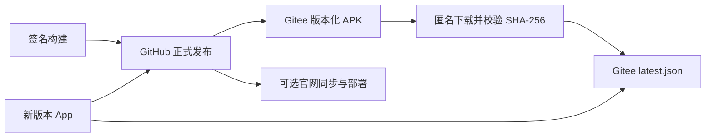

<!-- Gitee 备用更新源的接入、交付验证与旧版本过渡说明。 -->
# Gitee 备用更新源：接入与验收

## 当前事实（2026-10-09）

- 备用仓库：[l0x0hhh/Jicun](https://gitee.com/l0x0hhh/Jicun)，公开，默认分支 `master`。
- [更新清单](https://gitee.com/l0x0hhh/Jicun/raw/master/latest.json) 可匿名读取，接入前停在 `1.5.0`。
- `jicun-1.5.0.apk` 已匿名完整下载：13,752,007 字节，ZIP 结构完整，包含 AndroidManifest.xml 和 DEX。
- APK 最终响应是 `application/zip`，但 Content-Disposition 保留 `.apk` 文件名。App 读取字节流不依赖 MIME；手机浏览器能否正常保存和安装仍须实测。
- Netlify 线上清单仍停在 `1.5.2`，落地页仓库清单是 `1.5.5`。10 月 8 日的后台记录显示生产部署因额度暂停。
- 以上只证明公开读取与旧包下载可用，**尚未验证当前令牌的上传、Git 推送权限或新包真机覆盖安装**。

## 架构决策（2026-10-09）

**需求**：用现有 Gitee 仓库提供国内备用安装包，减少 App 更新对 Netlify 官网部署的依赖；暂不引入域名、云存储或新的付费服务。

**决定**：GitHub Releases 继续负责正式发布；Gitee 负责备用 APK 与清单；官网继续作为独立的可选分发点。新包查询 Gitee 与 GitHub，取较新版本，版本相同时优先镜像。

**权衡**：复用现有仓库和更新代码，接入成本较低；但 Gitee 上传、公开下载和目标网络可用性都必须验证。镜像失败不阻断 GitHub 发布，但不能把流水线成功解释为镜像交付成功。官网迁移到 GitHub Pages 属于后续阶段。



## 配置

在 Android 仓库 `l0x0hhh/zongce` 的 Settings → Secrets and variables → Actions 配置：

| 类型 | 名称 | 值或用途 |
| --- | --- | --- |
| Secret | `GITEE_TOKEN` | 有效的 Gitee 私人令牌，具有该仓库 API、附件上传和 Git 写权限；不要贴到聊天或提交到 Git |
| Variable | `GITEE_OWNER` | 默认 `l0x0hhh`，已有值时须核对 |
| Variable | `GITEE_REPO` | 默认 `Jicun`，注意大小写，已有值时须核对 |
| Variable | `APP_UPDATE_MANIFEST_URL` | 默认 `https://gitee.com/l0x0hhh/Jicun/raw/master/latest.json` |
| Variable | `LIVE_MANIFEST_URL` | 仅供官网验证，默认 `https://jicun.netlify.app/downloads/latest.json` |
| Variable | `LIVE_APK_URL` | 仅供官网验证，默认 `https://jicun.netlify.app/downloads/jicun.apk` |
| Secret | `LANDING_TOKEN` | 可选，向官网仓库同步 APK 与官网清单 |
| Secret | `SITE_DEPLOY_HOOK` | 可选，只触发官网部署，无法绕过 Netlify 额度限制 |

**不要把 `LIVE_*` 改成 Gitee 地址。** `APP_UPDATE_MANIFEST_URL` 同时用于编译 APK 和回读 Gitee 清单。配置解析会确认仓库公开、分支存在、清单地址与实际分支一致。

没有 `GITEE_TOKEN` 时，Gitee 步骤会跳过，新包仍保留默认镜像地址并能通过 GitHub 检查更新；发布摘要会明确指出镜像未确认交付。首次接入必须核对令牌，不能仅看整个 run 的绿灯。

## 发布行为

1. 校验正式版本号（三段数字）与 HTTPS 更新地址，运行测试并构建签名 APK。
2. 创建 GitHub Release；构建或正式发布失败时不会继续同步镜像及官网。
3. 读取或创建 Gitee 对应发行版，上传 `jicun-<版本>.apk`。已有同名附件不删除、不覆盖。
4. 匿名下载 Gitee 附件，要求 SHA-256 与本地签名包一致；不一致或不可下载就停止更新镜像清单。
5. 用 Git 在 `master` 发布 `latest.json`，保留完整发布说明，附上 `sha256` 和 `size` 字段。当前 App 忽略这两个额外字段，完整性检查由发布流程执行。
6. 匿名回读清单，精确比较版本、APK 地址、SHA-256 和大小。说明中出现版本号不算校验通过。
7. 官网另行同步与验证；失败单独记录，不影响已验证的 Gitee 更新交付。

所有正式发布共用一个队列；重跑旧标签时，发现镜像清单版本更高就拒绝覆盖。清单没有变化时仍执行线上回读。若同版本重新构建出的 APK 字节不同，镜像会拒绝覆盖已有附件，应发布新版本号。

上传最多尝试三次。超时可能发生在服务器已收到文件之后，流程会先匿名回读同名附件并校验，避免直接重复上传。摘要按真实 outcome 标明失败；continue-on-error 不会让后续清单步骤把上传失败当成成功。

## 已安装旧包怎么过渡

更新地址编译在 `BuildConfig.UPDATE_MANIFEST_URL` 中。切换只影响之后构建的 APK，已装机的 Netlify 版本不会自行发现 Gitee。

- GitHub 可达：用户通过现有 GitHub 更新源升级到包含 Gitee 地址的新包。
- GitHub 不可达且 Netlify 尚未恢复：向用户提供已验证的新版 Gitee 附件地址，手动覆盖安装。
- Netlify 恢复：继续向旧入口同步新包，让旧用户也能通过原有链路升级。

因此不必把恢复 Netlify 当成新链路上线的前置条件，但必须安排旧用户过渡。**保留 applicationId、正式签名密钥，并提高 versionCode；不要要求用户卸载重装，否则本地材料可能丢失。**

## 验收

- [ ] GitHub Release 正式包已发布。
- [ ] 分发摘要显示 Gitee 附件和更新清单都已验证通过；跳过或失败不能算镜像成功。
- [ ] 清单版本、APK 地址、SHA-256、大小与本次发布一致；附件匿名可下载。
- [ ] 真机用正式签名的新包覆盖安装，原有记录和照片保留。
- [ ] 在目标国内网络限制 GitHub 访问后，仍能从 Gitee 检查并下载下一版本更新。
- [ ] 手机上通过 Gitee 下载文件仍为 `.apk`，能交给系统安装器。
- [ ] 镜像失败时 GitHub 发布正常，旧镜像清单不会指向未验证的新附件。
- [ ] Netlify 部署失败时，摘要能区分官网失败和 Gitee 成功。

匿名清单检查（PowerShell）：

```powershell
curl.exe -f -sS -L https://gitee.com/l0x0hhh/Jicun/raw/master/latest.json
```

下载新包后用 `Get-FileHash -Algorithm SHA256 <APK路径>` 与清单中的 `sha256` 比较。文件结构校验不能代替正式签名和真机覆盖安装验证。

## 回滚与后续

附件验证失败时不更新镜像清单，GitHub 正式源继续可用；清单已经推送但回读失败时，应检查实际线上内容后重试。切回其他更新源需修改 `APP_UPDATE_MANIFEST_URL` 并发新版本，已装机包仍使用自己的旧地址。

本阶段不改变官网部署平台、不处理组件防抖逻辑，也不自动打版本标签。后续可把官网迁到 GitHub Pages，并将 APK 移出官网 Git 历史，避免每次发版继续累积二进制文件。
